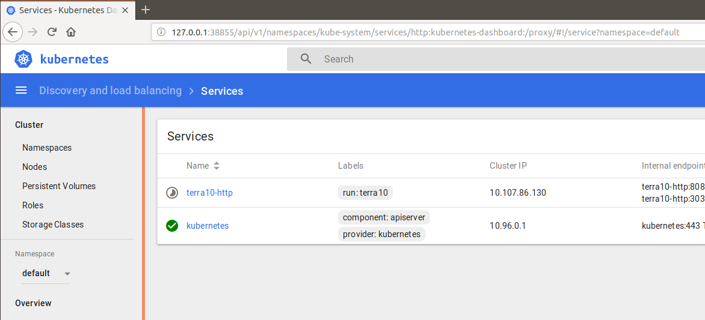

# 3. Scale and monitor that Pod!

In the Microservices / Container / Cloud world, horizontal scaling is ... well ... kind of a big thing.
This turns out to be surprisingly simple in our set-up.

First, have a look at the terra10 ReplicationController:
```bash
developer@developer-VirtualBox:~$ kubectl get rc terra10 
NAME      DESIRED   CURRENT   READY     AGE
terra10   1         1         1         7h
developer@developer-VirtualBox:~$
```
The ReplicationController column DESIRED shows the number of Pods that the ReplicationController wants to be alive. The CURRENT column is the well ... current number of Pods. 

Now scaling it turns out to be simple:
```bash
developer@developer-VirtualBox:~$ kubectl scale rc terra10 --replicas=3
replicationcontroller/terra10 scaled
developer@developer-VirtualBox:~$ kubectl get rc terra10
NAME      DESIRED   CURRENT   READY     AGE
terra10   3         3         1         8h
developer@developer-VirtualBox:~$
``` 
In the above listing, the `kubectl get rc terra10` command was given immediately after the `kubectl scale ...` command. It shows that 3 Pods are present, but the 2 new Pods are not Ready. Running the command again after some time shows that all Pods are Ready:
```bash
developer@developer-VirtualBox:~$ kubectl get rc terra10 
NAME      DESIRED   CURRENT   READY     AGE
terra10   3         3         3         8h
developer@developer-VirtualBox:~$
``` 
Looking at the Pods:
```bash
developer@developer-VirtualBox:~$ kubectl get pods
NAME            READY     STATUS    RESTARTS   AGE
terra10-98s4k   1/1       Running   0          7m
terra10-fw2c9   1/1       Running   0          7m
terra10-gtdcl   1/1       Running   1          8h
developer@developer-VirtualBox:~$
```
When pointing the browser to the Service terra10-http IP address, the page will always show the same result. The sticky session stuff makes you hit the same Pod over and over again. However, using curl will show that you the Service terra10-http distributes the calls over the Pods in a random order:
```bash
developer@developer-VirtualBox:$ kubectl get services
NAME           TYPE           CLUSTER-IP      EXTERNAL-IP   PORT(S)          AGE
kubernetes     ClusterIP      10.96.0.1       <none>        443/TCP          50d
terra10-http   LoadBalancer   10.105.67.164   <pending>     8080:32735/TCP   16m
developer@developer-VirtualBox:~$
developer@developer-VirtualBox:~$ curl 10.105.67.164:8080
Hello, you landed on Terra10 and host terra10-98s4k welcomes you!
developer@developer-VirtualBox:~$ curl 10.105.67.164:8080
Hello, you landed on Terra10 and host terra10-fw2c9 welcomes you!
developer@developer-VirtualBox:~$ curl 10.105.67.164:8080
Hello, you landed on Terra10 and host terra10-98s4k welcomes you!
developer@developer-VirtualBox:~$ curl 10.105.67.164:8080
Hello, you landed on Terra10 and host terra10-gtdcl welcomes you!
developer@developer-VirtualBox:~$ curl 10.105.67.164:8080
Hello, you landed on Terra10 and host terra10-gtdcl welcomes you!
developer@developer-VirtualBox:~$ curl 10.105.67.164:8080
Hello, you landed on Terra10 and host terra10-gtdcl welcomes you!
```

***
You can now try to scale down to 2 Pods using the command `kubectl scale rc terra10 --replicas=2`

Carefully examine what happens to your Pods!
***
By now, you have already covered some ground and should be familiar with the kubectl commands. We think it's important that you are familiar with the kubectl command line - even though we expect in a real production environment you will script your stuff :-S

Kubernetes also offers a dashboard that is convenient for looking at what is happening in your Kubernetes cluster. In minikube, you can launch the dashboard with the command:
```bash
developer@developer-VirtualBox:~$ minikube dashboard
Opening kubernetes dashboard in default browser...
developer@developer-VirtualBox:~$
```
The dashboard should pop up in your default browser. Now spend some time browsing it!



The `minikube dashboard` command opens the dashboard in your browser - always on a different port number. That's not very bookmarkable. An alternative approach is to look up the Cluster IP:
```bash
developer@developer-VirtualBox:~$ kubectl get service kubernetes-dashboard -n kube-system 
NAME                   TYPE        CLUSTER-IP       EXTERNAL-IP   PORT(S)   AGE
kubernetes-dashboard   ClusterIP   10.106.167.142   <none>        80/TCP    18h
developer@developer-VirtualBox:~$ 
```
Now, access the dashboard via http://10.106.167.142/ and bookmark it.

