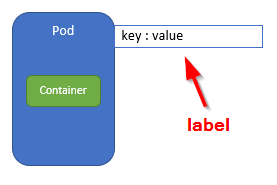
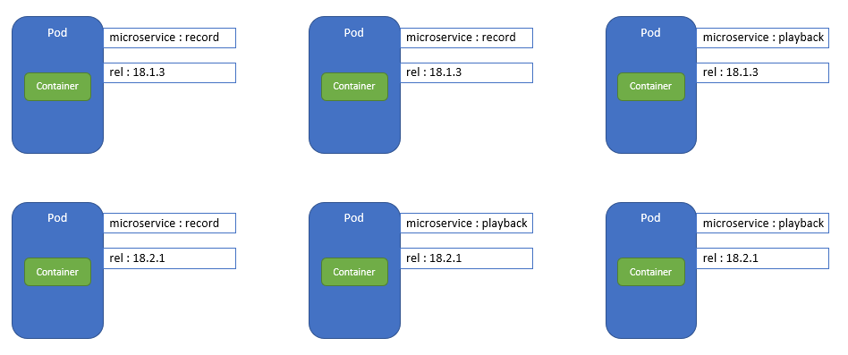

# 5. Pods and labels
Imagine a production Kubernetes cluster with ... drumroll ... over 100 Pods. That would be great. And a nightmare to keep them Pods apart.


You need to organise your stuff, and **labels** will come to the rescue.

A label is defined as a key-value pair that is attached to a Kubernetes object. You can define the keys, as long as they are unique for the object that you are attaching it to. You can attach labels to a pod:



An approach for organizing your Pods could be to assign a label 'microservice' which specifies the microservice and 'rel' which specifies the release version. You are now organizing on functionality and on release. Yes, we're on to something here ;-)


# Create a Pod with labels

Let's take this whole label thing step by step. An example of a yaml manifest for a Pod with labels looks like:
```bash
apiVersion: v1
kind: Pod
metadata:
  name: terra10-playback-0340
  labels:                           # Labels are added in the Pod manifest metadata section
    microservice: playback          # Add label 'microservice' with value 'playback'
    rel: 18.1.3                     # Add label 'rel' with value '18.1.3'
spec:
  containers:
  - image: lgorissen/terra10
    name: terra10
    ports:
    - containerPort: 8080
      protocol: TCP

```

Now, let's create some Pods with labels. We will create the situation below:





The `lab_05` directory has some yaml files that enable you to quickly create the desired situation:
```bash
developer@developer-VirtualBox:~/projects/k4d/lab 05$ kubectl create -f terra10-playback-18-1-3.yaml 
pod/terra10-playback-0340 created
developer@developer-VirtualBox:~/projects/k4d/lab 05$ kubectl create -f terra10-playback-18-2-1_01.yaml 
pod/terra10-playback-3542 created
developer@developer-VirtualBox:~/projects/k4d/lab 05$ kubectl create -f terra10-playback-18-2-1_02.yaml 
pod/terra10-playback-5674 created
developer@developer-VirtualBox:~/projects/k4d/lab 05$ kubectl create -f terra10-record-18-1-3_01.yaml 
pod/terra10-record-2874 created
developer@developer-VirtualBox:~/projects/k4d/lab 05$ kubectl create -f terra10-record-18-1-3_02.yaml 
pod/terra10-record-4139 created
developer@developer-VirtualBox:~/projects/k4d/lab 05$ kubectl create -f terra10-record-18-2-1.yaml 
pod/terra10-record-3899 created
developer@developer-VirtualBox:~/projects/k4d/lab 05$ kubectl get pod
NAME                    READY     STATUS    RESTARTS   AGE
terra10-gx6sr           1/1       Running   2          23h
terra10-playback-0340   1/1       Running   0          39s
terra10-playback-3542   1/1       Running   0          31s
terra10-playback-5674   1/1       Running   0          25s
terra10-qjdqv           1/1       Running   2          23h
terra10-record-2874     1/1       Running   0          15s
terra10-record-3899     1/1       Running   0          4s
terra10-record-4139     1/1       Running   0          11s
terra10-simple          1/1       Running   2          23h
terra10-z4lkv           1/1       Running   2          23h
```
As a side note, the above approach has at least 2 violations of best practices:
1. instead of directly creating multiple Pods of the same type, a ReplicationContoller (or ReplicaSet) should have been used. Creating multiple Pods of the same type is typically a Kubernetes task that should be done by a Kubernetes object
2. a rel tag inside the yaml file for the Pod is also questionable. It can be argued that such label should be applied after the Pod has been created, so a version label of the Pod is not included in the manifest of the Pod

As you can see in the Pod listing above, things already become ... obfuscated: too many Pods will clutter your view. But watch how labels will help us here...

List all Pods and their labels:
```bash
developer@developer-VirtualBox:~/projects/k4d/lab 05$ kubectl get pod --show-labels 
NAME                    READY     STATUS    RESTARTS   AGE       LABELS
terra10-gx6sr           1/1       Running   2          1d        run=terra10
terra10-playback-0340   1/1       Running   0          4m        microservice=playback,rel=18.1.3
terra10-playback-3542   1/1       Running   0          4m        microservice=playback,rel=18.2.1
terra10-playback-5674   1/1       Running   0          4m        microservice=playback,rel=18.2.1
terra10-qjdqv           1/1       Running   2          1d        run=terra10
terra10-record-2874     1/1       Running   0          4m        microservice=record,rel=18.1.3
terra10-record-3899     1/1       Running   0          4m        microservice=record,rel=18.2.1
terra10-record-4139     1/1       Running   0          4m        microservice=record,rel=18.1.3
terra10-simple          1/1       Running   2          23h       <none>
terra10-z4lkv           1/1       Running   2          1d        run=terra10
developer@developer-VirtualBox:~/projects/k4d/lab 05$ 
```
List Pods and values for labels microservice and rel:  
```bash
developer@developer-VirtualBox:~/projects/k4d/lab 05$ kubectl get pod -L microservice,rel
NAME                    READY     STATUS    RESTARTS   AGE       MICROSERVICE   REL
terra10-gx6sr           1/1       Running   2          1d                       
terra10-playback-0340   1/1       Running   0          6m        playback       18.1.3
terra10-playback-3542   1/1       Running   0          6m        playback       18.2.1
terra10-playback-5674   1/1       Running   0          5m        playback       18.2.1
terra10-qjdqv           1/1       Running   2          1d                       
terra10-record-2874     1/1       Running   0          5m        record         18.1.3
terra10-record-3899     1/1       Running   0          5m        record         18.2.1
terra10-record-4139     1/1       Running   0          5m        record         18.1.3
terra10-simple          1/1       Running   2          23h                      
terra10-z4lkv           1/1       Running   2          1d                       
```
Use a label selector to list Pods - list all Pods with microservice label value 'playback' 
```bash
developer@developer-VirtualBox:~/projects/k4d/lab 05$ kubectl get po -l microservice=playback
NAME                    READY     STATUS    RESTARTS   AGE
terra10-playback-0340   1/1       Running   0          9m
terra10-playback-3542   1/1       Running   0          9m
terra10-playback-5674   1/1       Running   0          9m
developer@developer-VirtualBox:~/projects/k4d/lab 05$
```

Use a label selector with multiple conditions - list all Pods with microservice label value 'record' and rel label value '18.1.3' 
```bash
developer@developer-VirtualBox:~/projects/k4d/lab 05$ kubectl get po -l microservice=record,rel=18.1.3
NAME                  READY     STATUS    RESTARTS   AGE
terra10-record-2874   1/1       Running   0          10m
terra10-record-4139   1/1       Running   0          10m
developer@developer-VirtualBox:~/projects/k4d/lab 05$ 
```

# Get organized - use labels!
