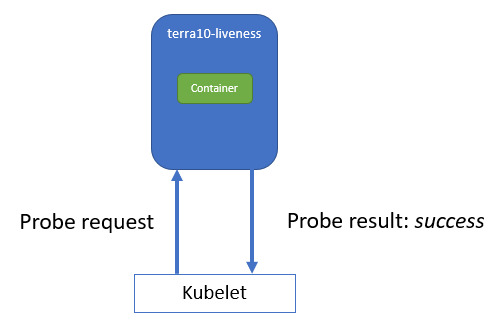
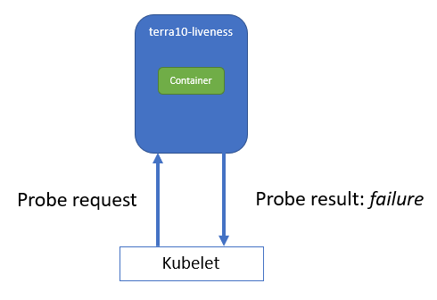
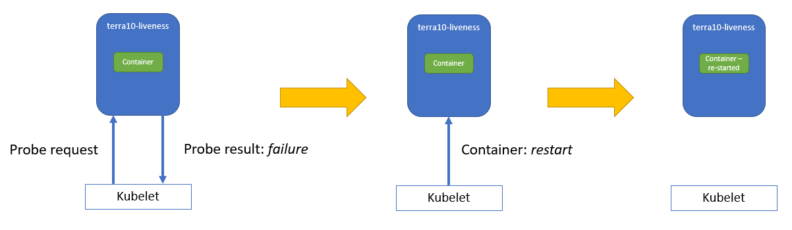

# 8. Doctor, doctor! My Pod is ill... (Probes)

Most of the labs so far are using only very basic functionality of Kubernetes. A bit of manual starting and stopping and labelling containers is not very advanced container management. That may make you wonder what the big Kubernetes-container-management fuzz is about... Don't worry, the next labs will reveal more management functionality.

This lab and the next ones will focus on functionality to deal with Pod failures. We will link the Kubernetes functionality to the type of failures that it will handle.

## 8.1 Container crash

Let's look at what happens to a manually started Pod...when the container crashes...
We will start the Pod terra10-simple (file in the `lab 08` directory) and then stop the Docker container manually - to simulate a container crash. The Kubelet should detect that the container is no longer present and will start a new container. So, after a short while, the Pod should be functioning again. Let's go:

**start the Pod and check that it works**

```bash
developer@developer-VirtualBox:~/projects/k4d/lab 08$ kubectl create -f terra10-simple.yaml 
pod/terra10-simple created
developer@developer-VirtualBox:~/projects/k4d/lab 08$ kubectl describe pod | grep '^IP*' 
IP:           172.17.0.4
developer@developer-VirtualBox:~/projects/k4d/lab 08$ curl 172.17.0.4:8080
Hello, you landed on Terra10 and host terra10-simple welcomes you!
developer@developer-VirtualBox:~/projects/k4d/lab 8$ kubectl get pod
NAME             READY     STATUS    RESTARTS   AGE
terra10-simple   1/1       Running   0          40s
developer@developer-VirtualBox:~/projects/k4d/lab 08$
```
**stop the Docker container manually:**

```bash
developer@developer-VirtualBox:~/projects/k4d/lab 08$ docker ps | grep "lgorissen/terra10" 
9476fc115575        lgorissen/terra10            "node terra10.js"        About a minute ago   Up About a minute                       k8s_terra10_terra10-simple_default_da2eddd1-bd7a-11e8-92aa-0800276251a2_0
developer@developer-VirtualBox:~/projects/k4d/lab 08$ docker stop 9476f
9476f
developer@developer-VirtualBox:~/projects/k4d/lab 08$
```

**observe**

Now, the kubelet should have started a new container (check for the new number) and the Pod should still be accessible:
```bash
developer@developer-VirtualBox:~/projects/k4d/lab 08$ docker ps | grep "lgorissen/terra10" 
b9930f825b93        lgorissen/terra10            "node terra10.js"        About a minute ago   Up About a minute                       k8s_terra10_terra10-simple_default_da2eddd1-bd7a-11e8-92aa-0800276251a2_1
developer@developer-VirtualBox:~/projects/k4d/lab 08$ curl 172.17.0.4:8080
Hello, you landed on Terra10 and host terra10-simple welcomes you!
developer@developer-VirtualBox:~/projects/k4d/lab 08$ 
```
Looking at the Pod shows that a restart has been done:
```bash
developer@developer-VirtualBox:~/projects/k4d/lab 08$ kubectl get pod
NAME             READY     STATUS    RESTARTS   AGE
terra10-simple   1/1       Running   1          5m
developer@developer-VirtualBox:~/projects/k4d/lab 08$ 

```

So, what happened in the above scenario is that the crashed container is automatically restarted by the Kubelet. This is default Pod behaviour that you'll get for free...

## 8.2 Container not running - Liveness Probe

A container can experience failures that do not result in a crash. For example, if the application is in a deadlock. In such cases, a restart of the container may help to recover the application.
In Kubernetes a Pod can define a Liveness Probe. The kubelet will then execute the defined Liveness Probe and based on the outcome, it may decide to restart the container:



As long as the probe returns the result ***success***, nothing will happen.

However, the probe can also return ***failure***:



In this case, the kubelet will restart the container:



The proof of the pudding is in the eating, so we'll try the following recipe:
- Create an app/container that has a liveness problem
- Start a Pod with this container AND a Liveness Probe
- Observe!

**Create an app/container that has a liveness problem**

The container image `lgorissen/terra10:liveness-problem` is already present in Docker Hub. For those of your who want to have a look at it, the code is in the `lab 08/terra10-liveness-problem'` directory.
This image will return upon the first 5 requests a response with HTTP 200 code. After the fifth request, it will return an HTTP 500 code:
```bash
developer@developer-VirtualBox:~/projects/k4d/lab 08$ docker run -d -p 8080:8080 lgorissen/terra10:liveness-problem 
Unable to find image 'lgorissen/terra10:liveness-problem' locally
liveness-problem: Pulling from lgorissen/terra10
f189db1b88b3: Already exists 
3d06cf2f1b5e: Already exists 
687ebdda822c: Already exists 
99119ca3f34e: Already exists 
e771d6006054: Already exists 
b0cc28d0be2c: Already exists 
7225c154ac40: Already exists 
7659da3c5093: Already exists 
6cb5c328fa33: Pull complete 
Digest: sha256:b8a42cbe50f9518aa989e948ce025f98d081188a43e577ba921cdb3dc00377f8
Status: Downloaded newer image for lgorissen/terra10:liveness-problem
331e335217b92280c89f3673721c2527e27f7145d786ef110af0a14765bd9713
developer@developer-VirtualBox:~/projects/k4d/lab 08$ 
```
Now, run curl for more than 5 times:

```bash
developer@developer-VirtualBox:~/projects/k4d/lab 08$ curl localhost:8080
Hello, you landed on Terra10 and host 511feac933d5 welcomes you!
developer@developer-VirtualBox:~/projects/k4d/lab 08$ curl localhost:8080
Hello, you landed on Terra10 and host 511feac933d5 welcomes you!
developer@developer-VirtualBox:~/projects/k4d/lab 08$ curl localhost:8080
Hello, you landed on Terra10 and host 511feac933d5 welcomes you!
developer@developer-VirtualBox:~/projects/k4d/lab 08$ curl localhost:8080
Hello, you landed on Terra10 and host 511feac933d5 welcomes you!
developer@developer-VirtualBox:~/projects/k4d/lab 08$ curl localhost:8080
Hello, you landed on Terra10 and host 511feac933d5 welcomes you!
developer@developer-VirtualBox:~/projects/k4d/lab 08$ curl localhost:8080
Something went wrong in your landing - this landing platform is malfunctioning: 511feac933d5
developer@developer-VirtualBox:~/projects/k4d/lab 08$ curl localhost:8080
Something went wrong in your landing - this landing platform is malfunctioning: 511feac933d5
developer@developer-VirtualBox:~/projects/k4d/lab 08$ curl localhost:8080
Something went wrong in your landing - this landing platform is malfunctioning: 511feac933d5
developer@developer-VirtualBox:~/projects/k4d/lab 08$ docker stop 511f
511f
developer@developer-VirtualBox:~/projects/k4d/lab 08$
```

**Start a Pod with this container AND a Liveness Probe**

Now, we will define a Pod that:
1. uses this malfunctioning container, and
2. has a Liveness Probe configured.

The manifest file looks like:
```bash
apiVersion: v1
kind: Pod
metadata:
  name: terra10-liveness                       # Pod name
spec:
  containers:
  - image: lgorissen/terra10:liveness-problem  # use the faulty image
    name: terra10
    livenessProbe:                             # Liveness Probe specification starts here
      httpGet:                                 # Probe of type httpGet
        path: /                                # Probe calls http://<Pod IP addres:8080/
        port: 8080
      initialDelaySeconds: 15                  # wait 15 seconds after container start
                                               # before invoking the probe
```
The comments in the above file are pretty self explanatory. Additionally:
- next to probe type `httpGet`, a probe can also be of type `exec` and `tcpSocket` : look them up in the reference documentation
- by default, the probe is executed every 10 seconds

Run the Pod:
```bash
developer@developer-VirtualBox:~/projects/k4d/lab 08$ kubectl create -f terra10-liveness-problem.yaml 
pod/terra10-liveness created
developer@developer-VirtualBox:~/projects/k4d/lab 08$ kubectl describe pod terra10-liveness | grep "IP:"
IP:           172.17.0.5
developer@developer-VirtualBox:~/projects/k4d/lab 08$ curl 172.17.0.5:8080
Hello, you landed on Terra10 and host terra10-liveness welcomes you!
developer@developer-VirtualBox:~/projects/k4d/lab 08$ kubectl get pod
NAME               READY     STATUS    RESTARTS   AGE
terra10-liveness   1/1       Running   0          1m
developer@developer-VirtualBox:~/projects/k4d/lab 08$ 
```
The Pod is running ...

**Observe!**

If you wait a couple of minutes, and look at the Pods, you will see something like:
```bash
developer@developer-VirtualBox:~/projects/k4d/lab 08$ kubectl get pod
NAME               READY     STATUS    RESTARTS   AGE
terra10-liveness   1/1       Running   3          6m
developer@developer-VirtualBox:~/projects/k4d/lab 08$
```
Ah, our Pod has been restarted 3 times. In short: the liveness probe has already restarted the faulted container 3 times. 

For a better understanding of how the Liveness Probe works and what can be configured, use the command `k describe pod terra10-liveness`  and have a close look at the output. Below, a description of the relevant parts of the Liveness Probe:
```bash
    Liveness:       http-get http://:8080/ delay=15s timeout=1s period=10s #success=1 #failure=3
```
This line means:

|  item         | description                        |
|---------------|------------------------------------|
| http-get      | Probe type                         |
| http://:8080/ | Action that the Probe will perform |
| delay=15s     | Number of seconds after the container has started before liveness probes are initiated. |
| timeout=1s    | Number of seconds after which the probe times out. |
| period=10s    | How often (in seconds) to perform the probe.|
| #success=1    | Minimum consecutive successes for the probe to be considered successful after having failed.|
| #failure=3    | Minimum consecutive failures for the probe to be considered failed after having succeeded.| 

Clean up!


## 8.3 Container not ready to service requests - Readiness Probe

Another typical situation for failures is that, upon start-up, the Pod/container may have a substantial initialization period. For example for establishing connections with other systems, building up caches in memory, etc. Readiness Probes to the rescue! A Readiness Probe determines if the Pod can handle requests. If not, no new requests are routed to that Pod until the Readiness Probe determines that the Pod is ready to handle requests again.

When ***the Pod's Ready condition*** is true, Kubernetes will route requests to that Pod. If not, Kubernetes will route the requests to another Pod copy that is able to handle the requests.

Again, the proof of the pudding is in the eating, so we'll:
- Create an app/container that has a readiness problem
- Start a Pod with this container AND a Readiness Probe
- Observe!

**Create an app/container that has a readiness problem**

The container image `lgorissen/terra10:readiness-problem` is already present in Docker Hub. For those of your who want to have a look at it, the code is in the `lab 08/terra10-readiness-problem` directory.
This image will return a response with HTTP 200 code for the first 10 requests. Then, it will return an HTTP 500 code for the next 10 requests. And then HTTP 200 for the next 10 requests, etc. Oh well, you get it.

First a local test: start the Container and curl it:
```bash
developer@developer-VirtualBox:~/projects/k4d/lab 08$ docker run -d -p 8080:8080 lgorissen/terra10:readiness-problem
Unable to find image 'lgorissen/terra10:readiness-problem' locally
readiness-problem: Pulling from lgorissen/terra10
f189db1b88b3: Already exists 
3d06cf2f1b5e: Already exists 
687ebdda822c: Already exists 
99119ca3f34e: Already exists 
e771d6006054: Already exists 
b0cc28d0be2c: Already exists 
7225c154ac40: Already exists 
7659da3c5093: Already exists 
f69dd07defd9: Pull complete 
Digest: sha256:d648ca178926177b1b5ef294987c836d890315be432df785746a4b7f09bdcc61
Status: Downloaded newer image for lgorissen/terra10:readiness-problem
7b92fba6a2ca741e22ce8500068750143119b7c801b7ceca202e299841221fe0
developer@developer-VirtualBox:~/projects/k4d/lab 08$ while true; do curl localhost:8080;sleep 1; done;
Something went wrong in your landing - this landing platform is malfunctioning: 7b92fba6a2ca
Something went wrong in your landing - this landing platform is malfunctioning: 7b92fba6a2ca
Something went wrong in your landing - this landing platform is malfunctioning: 7b92fba6a2ca
Something went wrong in your landing - this landing platform is malfunctioning: 7b92fba6a2ca
Something went wrong in your landing - this landing platform is malfunctioning: 7b92fba6a2ca
Something went wrong in your landing - this landing platform is malfunctioning: 7b92fba6a2ca
Something went wrong in your landing - this landing platform is malfunctioning: 7b92fba6a2ca
Something went wrong in your landing - this landing platform is malfunctioning: 7b92fba6a2ca
Something went wrong in your landing - this landing platform is malfunctioning: 7b92fba6a2ca
Hello, you landed on Terra10 and host 7b92fba6a2ca welcomes you!
Hello, you landed on Terra10 and host 7b92fba6a2ca welcomes you!
Hello, you landed on Terra10 and host 7b92fba6a2ca welcomes you!
Hello, you landed on Terra10 and host 7b92fba6a2ca welcomes you!
Hello, you landed on Terra10 and host 7b92fba6a2ca welcomes you!
Hello, you landed on Terra10 and host 7b92fba6a2ca welcomes you!
Hello, you landed on Terra10 and host 7b92fba6a2ca welcomes you!
Hello, you landed on Terra10 and host 7b92fba6a2ca welcomes you!
Hello, you landed on Terra10 and host 7b92fba6a2ca welcomes you!
Hello, you landed on Terra10 and host 7b92fba6a2ca welcomes you!
Something went wrong in your landing - this landing platform is malfunctioning: 7b92fba6a2ca
Something went wrong in your landing - this landing platform is malfunctioning: 7b92fba6a2ca
^C
developer@developer-VirtualBox:~/projects/k4d/lab 08$ 
```

**Start a Pod with this container AND a Readiness Probe**

Now, we will define a Pod that (1) uses this ready-status-toggling container and (2) has a Readiness Probe configured. The manifest file looks like:
```bash
apiVersion: v1
kind: Pod
metadata:
  name: terra10-readiness                        # Pod name
spec:
  containers:
  - image: lgorissen/terra10:readiness-problem   # use the faulty image
    name: terra10
    readinessProbe:                              # Liveness Probe specification starts here
      periodSeconds: 2                           # Probe runs every 2 seconds
      httpGet:                                   # Probe of type httpGet
        path: /                                  # Probe calls http://<Pod IP addres:8080/
        port: 8080
```

Run the Pod:
```bash
developer@developer-VirtualBox:~/projects/k4d/lab 08$ kubectl create -f terra10-readiness-problem.yaml 
pod/terra10-readiness created
developer@developer-VirtualBox:~/projects/k4d/lab 08$ kubectl describe pod terra10-readiness | grep "^IP:"
IP:           172.17.0.5
developer@developer-VirtualBox:~/projects/k4d/lab 08$ curl 172.17.0.5:8080
Hello, you landed on Terra10 and host terra10-readiness welcomes you!
developer@developer-VirtualBox:~/projects/k4d/lab 08$ kubectl get pod
NAME                READY     STATUS    RESTARTS   AGE
terra10-readiness   1/1       Running   0          39s
developer@developer-VirtualBox:~/projects/k4d/lab 08$ 
```
The Pod is running...

**Observe!**

For a better understanding of how the Readiness Probe works and what can be configured, use the command `kubectl describe pod terra10-readiness`  and have a close look at the output.

Below, a description of the relevant parts of the Readiness Probe:


```bash
    Readiness:      http-get http://:8080/ delay=0s timeout=1s period=2s #success=1 #failure=3
```

This line means:

|  item         | description                        |
|---------------|------------------------------------|
| http-get      | Probe type                         |
| http://:8080/ | Action that the Probe will perform |
| delay=0s     | Number of seconds after the container has started before readiness probes are initiated. |
| timeout=1s    | Number of seconds after which the probe times out. |
| period=2s    | How often (in seconds) to perform the probe.|
| #success=1    |Minimum consecutive successes for the probe to be considered successful after having failed.|
| #failure=3    | Minimum consecutive failures for the probe to be considered failed after having succeeded.| 

Now, we have Pod `tera10-readiness` running. This Pod has a Readiness probe that runs every 2 seconds. And after 10 requests, it will toggle between HTTP 200 and HTTP 500 responses. That means that our Pod Ready status must also toggle... let's find out:
```bash
developer@developer-VirtualBox:~/projects/k4d/lab 08$ while true; do kubectl get pod;sleep 2; done
NAME                READY     STATUS    RESTARTS   AGE
terra10-readiness   1/1       Running   1          1h
NAME                READY     STATUS    RESTARTS   AGE
terra10-readiness   1/1       Running   1          1h
NAME                READY     STATUS    RESTARTS   AGE
terra10-readiness   0/1       Running   1          1h
NAME                READY     STATUS    RESTARTS   AGE
terra10-readiness   0/1       Running   1          1h
NAME                READY     STATUS    RESTARTS   AGE
terra10-readiness   0/1       Running   1          1h
NAME                READY     STATUS    RESTARTS   AGE
terra10-readiness   0/1       Running   1          1h
NAME                READY     STATUS    RESTARTS   AGE
terra10-readiness   0/1       Running   1          1h
NAME                READY     STATUS    RESTARTS   AGE
terra10-readiness   0/1       Running   1          1h
NAME                READY     STATUS    RESTARTS   AGE
terra10-readiness   0/1       Running   1          1h
NAME                READY     STATUS    RESTARTS   AGE
terra10-readiness   1/1       Running   1          1h
NAME                READY     STATUS    RESTARTS   AGE
terra10-readiness   1/1       Running   1          1h
NAME                READY     STATUS    RESTARTS   AGE
terra10-readiness   1/1       Running   1          1h
```

Did you notice that the Pod is slightly more 'ready' than 'not ready'? That's because 1 successful probe request marks the Pod as 'ready', whereas it takes 3 failures to mark the Pod as 'not ready'.

Clean up!

## 8.4 Some concluding remarks

In this lab, we looked at the usage of Probes and how various categories of faults can be handled on a Kubernetes platform. Proper implementation of the Probes will give your application a better availability and those 'magical self-healing' capabilities that we are all looking for ;-)

In one of the next labs, we will show the combination of the Probes with a Resource Controller. That will also demonstrate that Kubernetes will NOT route requests to Pods that have status 'not ready'. 

## 8.5 Liveness vs Readiness probes

Sometimes people mix up Liveness and Readiness probes. The difference is in the action that Kubernetes takes when the probes report failure:
- Liveness probe failure: Kubernetes restarts the Pod
- Readiness probe failure: Kubernetes does not route new requests to the Pod

