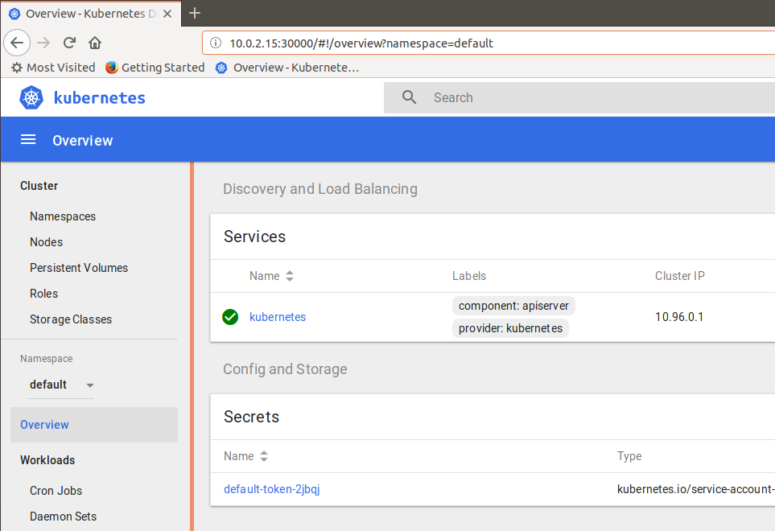
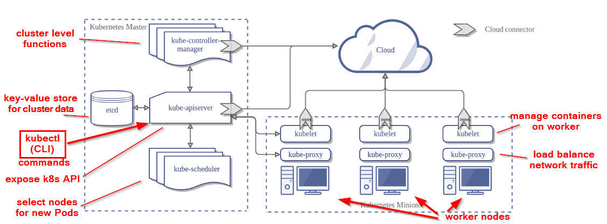

# 1. Preparing the environment

For running the exercises, a Kubernetes environment is required. The exercises are run with a minikube environment on an Ubuntu machine:
- Ubuntu 18.04
- docker 18.03.1-ce
- minikube v0.28.2
- kubernetes v1.10.0

You may choose to run the exercises on a different Kubernetes environment: the differences with the material presented in the labs should only be very small ;-)


## Docker
Go to the page [Docker installation](https://docs.docker.com/install/) 

Pick your server set-up and install the community edition.

Verifiy your Docker installation with:
```bash
developer@developer-VirtualBox:~$ docker run hello-world

Hello from Docker!
This message shows that your installation appears to be working correctly.

To generate this message, Docker took the following steps:
 1. The Docker client contacted the Docker daemon.
 2. The Docker daemon pulled the "hello-world" image from the Docker Hub.
    (amd64)
 3. The Docker daemon created a new container from that image which runs the
    executable that produces the output you are currently reading.
 4. The Docker daemon streamed that output to the Docker client, which sent it
    to your terminal.

To try something more ambitious, you can run an Ubuntu container with:
 $ docker run -it ubuntu bash

Share images, automate workflows, and more with a free Docker ID:
 https://hub.docker.com/

For more examples and ideas, visit:
 https://docs.docker.com/engine/userguide/

developer@developer-VirtualBox:~$
```

## Minikube

For installation of minikube, goto [the minikube releases page](https://github.com/kubernetes/minikube/releases)

Run the installation as described in the page above.

E.g., run the Linux intallation:
`curl -Lo minikube https://storage.googleapis.com/minikube/releases/v0.28.2/minikube-linux-amd64 && chmod +x minikube && sudo mv minikube /usr/local/bin/`
and then run the `minikube start` command

Tip: when running minikube in a VirtualBox virtual machine, the startup command will look like:
```bash
developer@developer-VirtualBox:~$ sudo minikube start --vm-driver=none
```
The `--vm-driver=none` option will ensure that minikube can run in a virtual machine.


Verify your minikube installation by querying the cluster info:
```bash
developer@developer-VirtualBox:~$ kubectl cluster-info
Kubernetes master is running at https://10.0.2.15:8443
KubeDNS is running at https://10.0.2.15:8443/api/v1/namespaces/kube-system/services/kube-dns:dns/proxy

To further debug and diagnose cluster problems, use 'kubectl cluster-info dump'.
developer@developer-VirtualBox:~$
```
Pointing your browser to the Kubernetes master url (here: https://10.0.2.15:8443) should bring you to the Kubernetes console:



**Autocomplete for kubectl**

A lot of exercises will require uasage of the kubectl command and argument. Therefore, it may be very useful to have an alias for kubectl (e.g, 'k') and to use the kubectl autocompletion.
How to configure this is described [here](https://kubernetes.io/docs/tasks/tools/install-kubectl/#enabling-shell-autocompletion).

For windows ... it's a bit more difficult: look [here]( https://medium.com/@sandipchitale/command-completion-for-minikube-and-kubectl-on-windows-10-580710bc464c)

Finally, you will end up with a Kubernetes system that has all the components of a full-fledged production system, albeit with only one master/worker node ...



For reference: Kubernetes documentation can be found . Throughout all labs, you can refer here for more information about all the different Kubernetes objects.
