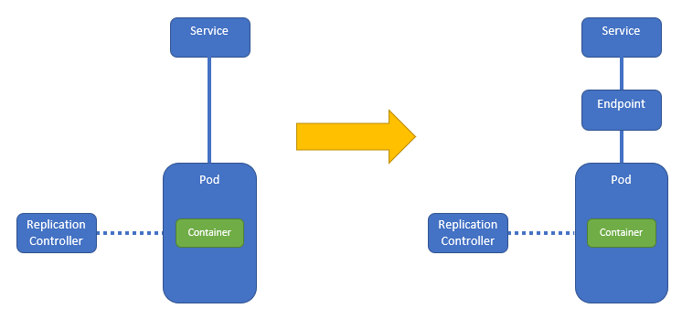

# 16. Endpoint: external services

So far, you always saw Services that forward requests to Pods. Well, ahum, we have a confession to make. There is more to it: between the Service and the Pods there are Endpoints.



You may have already seen these endpoints when looking at the description of a service. For example:

```bash
developer@developer-VirtualBox:~/projects/k4d/lab 16$ kubectl describe service terra10
Name:              terra10
Namespace:         default
Labels:            <none>
Annotations:       <none>
Selector:          app=terra10
Type:              ClusterIP
IP:                10.102.181.8
Port:              <unset>  80/TCP
TargetPort:        8080/TCP
Endpoints:         172.17.0.11:8080,172.17.0.4:8080,172.17.0.6:8080
Session Affinity:  None
Events:            <none>
developer@developer-VirtualBox:~/projects/k4d/lab 16$
```
The above listing shows 3 Endpoints. And as these Endpoints are a Kubernetes resource, we can query them:

```bash
developer@developer-VirtualBox:~/projects/k4d/lab 16$ kubectl get endpoints terra10
NAME      ENDPOINTS                                          AGE
terra10   172.17.0.11:8080,172.17.0.4:8080,172.17.0.6:8080   6h
developer@developer-VirtualBox:~/projects/k4d/lab 16$
```
In this lab we will show how external Services, i.e. outside the Kubernetes Cluster, can be accessed using end-points.

## External Service: by hostname

An external service can be referenced by hostname. The accompanying manifest file is `terra10-service-by-hostname.yaml` (in the lab 16 directory):

```bash
apiVersion: v1
kind: Service                # a resource of type Service
metadata:
  name: terra10-service      # the Service name
spec:
  type: ExternalName         # maps a service to an external DNS name
  externalName: terra10.io   # in this case ... terra10.io
```

So, let's create the Service:

```bash
developer@developer-VirtualBox:~/projects/k4d/lab 16$ kubectl create -f terra10-service-by-hostname.yaml 
service/terra10-service created
developer@developer-VirtualBox:~/projects/k4d/lab 16$ kubectl describe service terra10-service 
Name:              terra10-service
Namespace:         default
Labels:            <none>
Annotations:       <none>
Selector:          <none>
Type:              ExternalName
IP:                
External Name:     terra10.io
Session Affinity:  None
Events:            <none>
developer@developer-VirtualBox:~/projects/k4d/lab 16$
```

This does not seem too fancy, but it is a very nice and powerfull concept: you can now access the `terra10.io` host from all pods by using the Kubernetes FQDN ` terra10-service.default.service.cluster.local`. So this mechanism centralizes the connection from your pods to a service in the external world in one single point!

Time to verify if the Kubernetes FQDN works (we still have some pods running from lab 4):

```bash
developer@developer-VirtualBox:~/projects/k4d/lab 16$ kubectl get pod
NAME               READY     STATUS    RESTARTS   AGE
terra10-rs-f99sq   1/1       Running   3          4d
terra10-rs-j6d7s   1/1       Running   3          4d
terra10-rs-p26rc   1/1       Running   3          4d
developer@developer-VirtualBox:~/projects/k4d/lab 16$ kubectl exec terra10-rs-f99sq -it bash
root@terra10-rs-f99sq:/# ping terra10-service
PING terra10.io (52.47.106.157) 56(84) bytes of data.
^C
--- terra10.io ping statistics ---
12 packets transmitted, 0 received, 100% packet loss, time 11249ms

root@terra10-rs-f99sq:/# curl terra10-service.default.svc.cluster.local
<!DOCTYPE html>
<html lang="en">

  <head>

    <meta charset="utf-8">
    <meta name="viewport" content="width=device-width, initial-scale=1, shrink-to-fit=no">
    <meta name="description" content="">
    ...
```
Great, you will see the web page for the Terra10 web site appear.

Of course ... this mechanisme can also be use to access REST services ;-)


## External Service: by IP address

It is also possible to separate the creation of the Service and Endpoints. As a benefit of this approach, it is possible to change the Endpoints only, when a service is re-located or perhaps even put inside a Pod in the Cluster.

We will do the following steps:

1. create an 'external' service
2. create the Endpoints
3. create the Service
4. test

Go!

### 1 create an 'external' service

To make this a bit more realistic, we first start a service on the machine that's also running the minikube. Let's pretend that that is the External Service. The service returns drone parts:

```bash
developer@developer-VirtualBox:~$ docker run -d -p 8082:8080 lgorissen/dronebuzzers-parts
83b716b8e82e1c10d51e9b77c436b5f081bb83a7a69996a272f601d7a64e1089
developer@developer-VirtualBox:~$ curl 10.0.2.15:8082/parts
[{"id":"DB-38406","type":"Motor","name":"DroneBuzzer regular","count":1,"price":
18.95,"currency":"EUR"},{"id":"DB-38606","type":"Motor","name":"DroneBuzzer racer",
"count":1,"price":21.95,"currency":"EUR"},{"id":"DB-SC-622-25A","type":"Speedcontroller",
"name":"DroneBuzzer speedcontoller regular - 25A","count":1,"price":8.95,"currency":
"EUR"},{"id":"DB-SC-629-40A","type":"Speedcontroller","name":"DroneBuzzer speedcontoller
 racer - 40A","count":1,"price":8.95,"currency":"EUR"},{"id":"DB-FC-9773-A",
 "type":"Flightcontroller","name":"DroneBuzzer flightcontoller regular - 4ch","count":1,
 "price":24.15,"currency":"EUR"},{"id":"DB-FC-9773-R","type":"Speedcontroller",
 "name":"DroneBuzzer speedcontoller racer - 4ch","count":1,"price":43.95,
 "currency":"EUR"}]developer@developer-VirtualBox:~$
```

Don't order any drone parts there: they're too expensive ;-)

Note that this 'external' service runs on the cluster IP, which is sufficient for our purposes.

### 2 create the Endpoints

The Endpoints (only one) for this service are described in the manifest below (file `dronebuzzers-service-endpoints.yaml`in the `lab 16` directory):

```bash
apiVersion: v1
kind: Endpoints               # resource type
metadata:
  name: dronebuzzers-service  # name must match the service name that uses these endpoints 
subsets:
  - addresses:
    - ip: 10.0.2.15           # (list of) IP address(es)
    ports:
    - port: 8082              # port

```

So the above manifest will create an endpoint to the 'external' service. Create it:

```bash
developer@developer-VirtualBox:~/projects/k4d/lab 16$ kubectl create -f dronebuzzers-service-endpoints.yaml 
endpoints/dronebuzzers-service created
developer@developer-VirtualBox:~/projects/k4d/lab 16$ kubectl describe endpoints dronebuzzers-service 
Name:         dronebuzzers-service
Namespace:    default
Labels:       <none>
Annotations:  <none>
Subsets:
  Addresses:          10.0.2.15
  NotReadyAddresses:  <none>
  Ports:
    Name     Port  Protocol
    ----     ----  --------
    <unset>  8082  TCP

Events:  <none>
developer@developer-VirtualBox:~/projects/k4d/lab 16$
```

Go go go.


### 3 create the Service

Next step is to create the Service that will use the above created endpoints. The manifest file is `dronebuzzers-service.yaml`: 

```bash
apiVersion: v1
kind: Service
metadata:
  name: dronebuzzers-service    # the name must match the name of the Endpoints 
spec:
  ports:
  - port: 8082                  # open the right port
```

Create the Service:

```bash
developer@developer-VirtualBox:~/projects/k4d/lab 16$ kubectl create -f dronebuzzers-service.yaml 
service/dronebuzzers-service created
developer@developer-VirtualBox:~/projects/k4d/lab 16$ 
```

You must have done that blindfolded by now.


### 4 test

Testing of the Service will be done by logging in into an already running Pod and then invoking the External Service using its Kubernetes FQDN:

```bash
developer@developer-VirtualBox:~/projects/k4d/lab 16$ kubectl get pod
NAME               READY     STATUS    RESTARTS   AGE
terra10-rs-f99sq   1/1       Running   6          7d
terra10-rs-j6d7s   1/1       Running   6          7d
terra10-rs-p26rc   1/1       Running   6          7d
developer@developer-VirtualBox:~/projects/k4d/lab 16$ kubectl exec terra10-rs-f99sq -it bash
root@terra10-rs-f99sq:/# curl dronebuzzers-service.default.svc.cluster.local:8082/parts
[{"id":"DB-38406","type":"Motor","name":"DroneBuzzer regular","count":1,"price":18.95,"currency":"EUR"},{"id":"DB-38606","type":"Motor","name":"DroneBuzzer racer","count":1,"price":21.95,"currency":"EUR"},{"id":"DB-SC-622-25A","type":"Speedcontroller","name":"DroneBuzzer speedcontoller regular - 25A","count":1,"price":8.95,"currency":"EUR"},{"id":"DB-SC-629-40A","type":"Speedcontroller","name":"DroneBuzzer speedcontoller racer - 40A","count":1,"price":8.95,"currency":"EUR"},{"id":"DB-FC-9773-A","type":"Flightcontroller","name":"DroneBuzzer flightcontoller regular - 4ch","count":1,"price":24.15,"currency":"EUR"},{"id":"DB-FC-9773-R","type":"Speedcontroller","name":"DroneBuzzer speedcontoller racer - 4ch","count":1,"price":43.95,"currency":"EUR"}]root@terra10-rs-f99sq:/# 
```

Nifty!


## Summary 

This lab shows 2 ways to access external services via a Kubernetes Service: via hostname and via IP address. Both ways make it easier to absorb (specific) changes in external services, as they will be limited to a single point.
