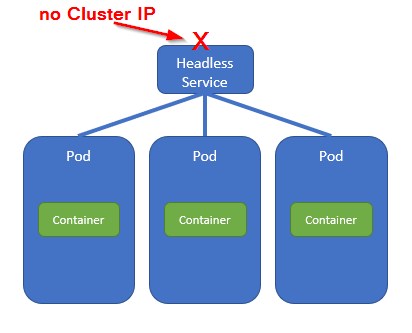

# 17. Headless service: point-to-multipoint

The use case for a Headless Service is *the discovery of ALL Pods that are backing up a Service*. That could be done using the Kubernetes API server, but that would make the Pod-internal application code sensitive to being run on a Kubernetes platform. That's something you don't want!

Instead, you can use a Headless service and then look up the Pods IP addresses through a DNS lookup.



The Headless service does not have a Cluster IP address that could be used by Clients. The manifest file for such a Headless service should look pretty familiar (`terra10-service-headless.yaml` in the `lab 17` directory):

```bash
apiVersion: v1
kind: Service
metadata:
  name: terra10-headless
spec:
  clusterIP: None          # No cluster IP and therefore a Headless Service
  ports:
  - port: 80
    targetPort: 8080
  selector:
    app: terra10           # Pod selector
```

Now, first let's create some Pods with a ReplicaSet and then create the Headless Service:

```bash
developer@developer-VirtualBox:~/projects/k4d/lab 17$ kubectl create -f terra10-replicaset.yaml 
replicaset.apps/terra10-rs created
developer@developer-VirtualBox:~/projects/k4d/lab 17$ kubectl get rs
NAME         DESIRED   CURRENT   READY     AGE
terra10-rs   3         3         1         4s
developer@developer-VirtualBox:~/projects/k4d/lab 17$ kubectl create -f terra10-service-headless.yaml 
service/terra10-headless created
developer@developer-VirtualBox:~/projects/k4d/lab 17$ kubectl get service terra10-headless 
NAME               TYPE        CLUSTER-IP   EXTERNAL-IP   PORT(S)   AGE
terra10-headless   ClusterIP   None         <none>        80/TCP    7s
developer@developer-VirtualBox:~/projects/k4d/lab 17$ 
```

Looking at the Headless service will reveal the Endpoints:

```bash
developer@developer-VirtualBox:~/projects/k4d/lab 17$ kubectl describe service terra10-headless 
Name:              terra10-headless
Namespace:         default
Labels:            <none>
Annotations:       <none>
Selector:          app=terra10
Type:              ClusterIP
IP:                None
Port:              <unset>  80/TCP
TargetPort:        8080/TCP
Endpoints:         172.17.0.5:8080,172.17.0.6:8080,172.17.0.7:8080
Session Affinity:  None
Events:            <none>
developer@developer-VirtualBox:~/projects/k4d/lab 17$
```

**Test**

In order to test the DNS lookup, we will (1) start a Pod with dnsutils on board and (2) do a DNSlookup for the FQDN for the Headless Service `terra10-headless`. 

@1: start dnsutils Pod

```bash
developer@developer-VirtualBox:~/projects/k4d/lab 17$ kubectl run dnsutils --image=tutum/dnsutils --generator=run-pod/v1 --command -- sleep infinity
pod/dnsutils created
developer@developer-VirtualBox:~/projects/k4d/lab 17$ kubectl get pod dnsutils 
NAME       READY     STATUS    RESTARTS   AGE
dnsutils   1/1       Running   0          5s
developer@developer-VirtualBox:~/projects/k4d/lab 17$ 
```
and then @2: do a DNSlookup in dnslutils Pod

```bash
developer@developer-VirtualBox:~/projects/k4d/lab 17$ kubectl exec dnsutils nslookup terra10-headless
Server:		10.96.0.10
Address:	10.96.0.10#53

Name:	terra10-headless.default.svc.cluster.local
Address: 172.17.0.6
Name:	terra10-headless.default.svc.cluster.local
Address: 172.17.0.7
Name:	terra10-headless.default.svc.cluster.local
Address: 172.17.0.5

developer@developer-VirtualBox:~/projects/k4d/lab 17$ 
```

What more could you wish for :-S

