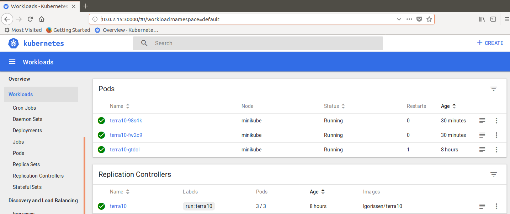
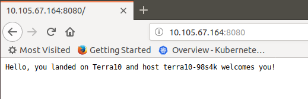

#2. Run that app on Kubernetes

Steps:
- Run a Docker container
- Run the container in Kubernetes

##2.1 Run a Docker container

Run the container lgorissen/terra10 in Docker:

```bash
developer@developer-VirtualBox:~$ docker run -d -p 8080:8080 lgorissen/terra10
Unable to find image 'lgorissen/terra10:latest' locally
latest: Pulling from lgorissen/terra10
f189db1b88b3: Pull complete 
3d06cf2f1b5e: Pull complete 
687ebdda822c: Pull complete 
99119ca3f34e: Pull complete 
e771d6006054: Pull complete 
b0cc28d0be2c: Pull complete 
7225c154ac40: Pull complete 
7659da3c5093: Pull complete 
6344e0cb73bc: Pull complete 
Digest: sha256:5b3f0afec5aac18c25749370f4ced0133b43041390cf0891a308d2261df97e7b
Status: Downloaded newer image for lgorissen/terra10:latest
Terra10 HelloWorld Server is starting...
Terra10 HelloWorld Server started
```
Verify that the container is running:

```bash
developer@developer-VirtualBox:~$ docker ps | grep terra
635340f653cd        lgorissen/terra10            "node terra10.js"        39 seconds ago      Up 37 seconds       0.0.0.0:8080->8080/tcp                                               jovial_kare
developer@developer-VirtualBox:~$ 
```

Pointing the browser to `http://localhost:8080/` shows the page:



Note that the container id is the hostname...


##2.2 Run the container in Kubernetes


Goal is now to run the container in Kubernetes. The figure below illustrates the configuration that we want to build:


The figure shows 3 Kubernetes components:
- **Pod**: a group of one or more containers that is running on the same node
- **Service**: defines a policy on how to access (a number of) pod(s)
- **ReplicationController**: ensures that a specified number of pod replicas are running at any one time

We wil create this configuration in 2 steps:
1. run the container in a Pod, controlled by a ReplicationController
2. create an endpoint for accessing the terra10 app

###2.2.1 Run the container in a Pod
Now, let's run the container under Kubernetes:
```bash
developer@developer-VirtualBox:~$ k run terra10 --image=lgorissen/terra10 --port=8080 --generator=run/v1
replicationcontroller/terra10 created
developer@developer-VirtualBox:~$ 
```
Where:
- **k** ::  short for kubectl (is your auto-complete running properly?)
- **terra10** :: name of the ReplicationController that will be created
- **--image=lgorissen/terra10** :: name of the image that will be used
- **--port=8080** :: the port that the app will listen to
- **--generator=run/v1** :: indicates that a ReplicationController will be created

This command has created the ReplicationController terra10, which in turn will create the Pod with the lgorissen/terra10 container running inside.

Verify that the ReplicationController is there:
```bash
developer@developer-VirtualBox:~$ k get rc
NAME      DESIRED   CURRENT   READY     AGE
terra10   1         1         1         34m
developer@developer-VirtualBox:~$
```
Verify that the Pod is there:

```bash
developer@developer-VirtualBox:~$ k get pod
NAME            READY     STATUS    RESTARTS   AGE
terra10-gtdcl   1/1       Running   0          37m
developer@developer-VirtualBox:~$ 
```
###2.2.2. create an endpoint for accessing the terra10 app

With the Pod running, now it has to be made accessible. Let's create a Service object to expose the terra10 ReplicationController:
```bash
developer@developer-VirtualBox:~/projects/k4d$ k expose rc terra10 --type=LoadBalancer --name terra10-http
service/terra10-http exposed
developer@developer-VirtualBox:~/projects/k4d$ 
```
The above command creates a Service object of type LoadBalancer. Verify with:
```bash
developer@developer-VirtualBox:~/projects/k4d$ k get services
NAME           TYPE           CLUSTER-IP      EXTERNAL-IP   PORT(S)          AGE
kubernetes     ClusterIP      10.96.0.1       <none>        443/TCP          50d
terra10-http   LoadBalancer   10.105.67.164   <pending>     8080:32735/TCP   16m
developer@developer-VirtualBox:~/projects/k4d$ 
```

In a 'real' Kubernetes implementation, the EXTERNAL-IP column will show an IP address after some time. You can then test your service by running 'curl <external-ip-address>:8080' and your terra10 service should give a response.
In minikube however, LoadBalancer servcies are not supported. To find out how to access the service, run the command below:
```bash
developer@developer-VirtualBox:~$ minikube service terra10-http
Opening kubernetes service default/terra10-http in default browser...
developer@developer-VirtualBox:~$ 
```
That will open the service in you default browser:



Note that the 'os.hostname' that is shown by the Node.JS app is the name of the Pod.

We have now realized the configuration below:


**Networking**
A Pod is a group of containers that runs on the same node and in the same Linux namespace. Therefore, the Pod not only has its own files and processes, but also its own network interfaces and hostname. So, the Pod has its own IP address and the hostname is the same as the Pod name. 
[todo: make a network diagram drawing here]

** Cluster IP address:**
```bash
developer@developer-VirtualBox:~$ minikube ip
10.0.2.15
developer@developer-VirtualBox:~$
```
or

```bash
developer@developer-VirtualBox:~$ k cluster-info
Kubernetes master is running at https://10.0.2.15:8443
KubeDNS is running at https://10.0.2.15:8443/api/v1/namespaces/kube-system/services/kube-dns:dns/proxy

To further debug and diagnose cluster problems, use 'kubectl cluster-info dump'.
developer@developer-VirtualBox:~$
```
**Service IP address**
```bash
developer@developer-VirtualBox:~/projects/k4d$ k get services
NAME           TYPE           CLUSTER-IP      EXTERNAL-IP   PORT(S)          AGE
kubernetes     ClusterIP      10.96.0.1       <none>        443/TCP          50d
terra10-http   LoadBalancer   10.105.67.164   <pending>     8080:32735/TCP   16m
developer@developer-VirtualBox:~/projects/k4d$ 
```
**Pod IP address**
```bash
developer@developer-VirtualBox:~$ k describe pod terra10-gtdcl 
Name:           terra10-gtdcl
Namespace:      default
Node:           minikube/10.0.2.15
Start Time:     Fri, 14 Sep 2018 10:45:07 +0200
Labels:         run=terra10
Annotations:    <none>
Status:         Running
IP:             172.17.0.6
Controlled By:  ReplicationController/terra10
Containers:
  terra10:
    Container ID:   docker://8ad3797e6e
...
...	
```
--> the Pod IP address is 172.17.0.6


So, on minikube, our app is accessible on:

http://10.0.2.15:32735/ -- via the Kubernetes Cluster IP
http://10.105.67.164:8080/ -- via the Service IP
http://172.17.0.6:8080/ -- via the Pod IP

In a comercial Cloud's Kubernetes environment, all of the above IPs will normally not be publicly accessible. The Service IP will normally have an External IP, that will be.


