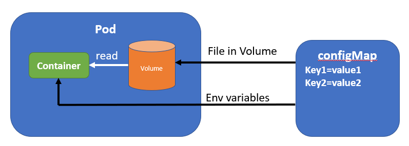
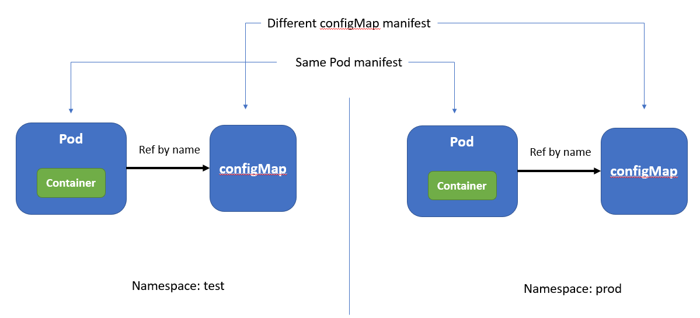

# 21. Volume configMap

Your Pod consists of a number of Containers, and each of them requires configuration data - well, except for the most simple cases. 

## Containers and Pod specification

For Containers, configuration information can be passed in as:
1. Command-line arguments 
2. Environment variables

#### 1. Pod specification and Command-line arguments
How a Docker Container is started is defined in the Dockerfile. The Dockerfile uses the ENTRYPOINT and CMD instructions to start the image. The preferred way to do this is to:

- Use ENTRYPOINT in the exec format: `ENTRYPOINT ["<executable>" , "<par 1>", "<par 2>", ...]`
- Use CMD to define the default parameters to ENTRYPOINT: `CMD [ "<par 1>", "<par 2>", ...]`

For example:

```bash
ENTRYPOINT ["/bin/myterra.sh"]
CMD ["60"]
```

Note:

- using ENTRYPOINT in the exec format avoids running the executable in a shell;
- having default values for the parameters ensures that you can start your Container with default values

In Kubernetes, the Container specification in a Pod can overrride the ENTRYPOINT and CMD entries. This is how they map/match:

| Docker  | Kubernetes - Container specification in Pod |
|---------|-------------|
| ENTRYPOINT | command |
| CMD     | args |

For example, a Pod manifest file's container specification could look like:

```bash
kind: Pod
spec: 
  containers:
  - image: lgorissen/terra10
    command: ["/bin/my-terra-command"]
    args: ["10"]
```

#### 2. Pod specification and Environment variables

Many Containers rely on environment variables for their configuration. Therefore, Kubernetes allows you to define environment variables. Those environment variables are specified in the Pod specification, but on the Container level. That makes sense, as this keeps the Containers independent. In the Pod manifest file, the configuration of environment variables is done like shown below:

```bash
kind: Pod
spec:
  containers:
  - image: lgorissen/terra10
    env:
    - name: TRANSPORTER_PLATFORM
      value: "12"

```
For the Terra10 transporter Container, the environment variable 'TRANSPORTER_PLATFORM' defines what platform is used for transporting ;-)

#### Pod specification and configuration - a small exercise

**- Docker Container lgorissen/terra10-transporter:config**

We have a Container named `lgorissen/terra10-transporter:config`, that has two configuration options:

1.  Environment variable TRANSPORTER_PLATFORM
2.  Command line argument that indicates the 'transporter delay'. It has a default value (in the Dockerfile) of 60.

The Docker container can be started manually and then used. Note:

- the environment variable is passed to the Container using `-e TRANSPORTER_PLATFORM=local_13`
- the command line argument is passed to the Containter after the container name: `30`


```bash
developer@developer-VirtualBox:~/projects/k4d/lab 21$ docker run -d --name terra10-transporter-config -p 8096:8096 -e TRANSPORTER_PLATFORM=local_13 lgorissen/terra10-transporter:config 30
Unable to find image 'lgorissen/terra10-transporter:config' locally
config: Pulling from lgorissen/terra10-transporter
f189db1b88b3: Already exists 
3d06cf2f1b5e: Already exists 
687ebdda822c: Already exists 
99119ca3f34e: Already exists 
e771d6006054: Already exists 
b0cc28d0be2c: Already exists 
7225c154ac40: Already exists 
7659da3c5093: Already exists 
70b0ce2db752: Pull complete 
Digest: sha256:1edb70b5563367b7998cf0cdb7f712b3c3bff8098132550459383b58d85a948b
Status: Downloaded newer image for lgorissen/terra10-transporter:config
2f4203a3ee67787fd4f53b048bb99d36907bcf4232f8b19c11369960226371f3
developer@developer-VirtualBox:~/projects/k4d/lab 21$ curl localhost:8096
Hello, transporter local_13 will transport you in 30 seconds 
developer@developer-VirtualBox:~/projects/k4d/lab 21$ 
```
**- Pod specification using Docker Container lgorissen/terra10-transporter:config**

The same Container can be used in a Pod. The manifest file `terra10-transporter-config` can be found in the `lab 21` directory:

```bash
apiVersion: v1
kind: Pod
metadata:
  name: terra10-transporter-config
spec:
  containers:
  - image: lgorissen/terra10-transporter:config
    env:
    - name: TRANSPORTER_PLATFORM
      value: "local_container"
    args: ["12"]
    name: terra10-transporter-config
    ports:
    - containerPort: 8096
      protocol: TCP
```

Run and test:

```bash
developer@developer-VirtualBox:~/projects/k4d/lab 21$ k create -f terra10-transporter-config.yaml 
pod/terra10-transporter-config created
developer@developer-VirtualBox:~/projects/k4d/lab 21$ k describe pod terra10-transporter-config | grep "^IP:" 
IP:           172.17.0.11
developer@developer-VirtualBox:~/projects/k4d/lab 21$ curl 172.17.0.11:8096
Hello, transporter local_container will transport you in 12 seconds 
developer@developer-VirtualBox:~/projects/k4d/lab 21$
```


#### Pod specification and configuration - not a happy marriage

It does not take a Kubernetes wizzard to understand that hard-coding configuration information in a Pod specification is not a desirable situation. You will end up with different Pod specifications for different environments. As the Pod is basically your application specification, it does not feel good to have a different specification for each environment. The configuration data has to go: please welcome the ConfigMap.

## ConfigMap to the rescue...

The ConfigMap is a Kubernetes object which contains key-value pairs. The values are passed on the the Containers as environment variables or as files in a Volume.



The Pod refers to a configMap by name. In that way, the *different configuration for different environments* question is addressed:



Note that configuration of different environments in this requires those different environments to be handled in different Kubernetes namespaces! Which is a sensible thing to do anyway...


## configMap example

Now it's time to start putting the configMap to use. Our goal is to use the configMap for the above example. So we need a configMap and a Pod manifest that refers to it. 

**ConfigMap manifest**

First, create a ConfigMap that has the 2 configuration items for the `lgorissen/terra10-transporter:config` Container. It is in the file `terra10-transporter-configMap.yaml` that is in the `lab 21` directory:

```bash
apiVersion: v1
kind: ConfigMap                             # object type ConfigMap
metadata:
  name: terra10-transporter-config          # name of the configMap
data:
  transporter-delay: "45"                   # key-value pair
  transporter-platform: "local_development" # key-value pair
```


**Pod manifest**

Now that the configMap is defined, the Pod manifest can put it to use (`terra10-transporter-pod.yaml`). In this example we see how a Container argument and an environment variable get their values from the `terra10-transporter-config` ConfigMap that was defined above.

```bash
apiVersion: v1
kind: Pod
metadata:
  name: terra10-transporter                      # name of the Pod
spec:
  containers:
  - image: lgorissen/terra10-transporter:config  # name of the Container image
    env:
    - name: TRANSPORTER_PLATFORM                 # Container has env var TRANSPORTER_PLATFORM
      valueFrom:                                 # start of def where the var gets its value
        configMapKeyRef:                         # ... from a ConfigMap
          name: terra10-transporter-config       # ... named terra10-transporter-config
          key: transporter-platform              # ... using key transporter-platform
    - name: TRANSPORTER_DELAY                    # Container has env var TRANSPORTER_DELAY
      valueFrom:                                 # start of def where the var gets its value
        configMapKeyRef:                         # ... from a ConfigMap
          name: terra10-transporter-config       # ... named terra10-transporter-config
          key: transporter-delay                 # ... using key transporter-delay
    args: ["$(TRANSPORTER_DELAY)"]               # and the argument is set using the env var!
    name: terra10-transporter                    # Container name
    ports:
    - containerPort: 8096                        # port
      protocol: TCP
```

Note in the above manifest file how the Container argument is set using the environment variable.


Running and testing the things is done in 3 steps:

1. Create the ConfigMap and look at its contents
2. Create the Pod
3. Look up the IP address of the Pod
4. curl to the Pod

```bash
developer@developer-VirtualBox:~/projects/k4d/lab 21$ k create -f terra10-transporter-configMap.yaml 
configmap/terra10-transporter-config created
developer@developer-VirtualBox:~/projects/k4d/lab 21$ k describe configmaps terra10-transporter-config 
Name:         terra10-transporter-config
Namespace:    default
Labels:       <none>
Annotations:  <none>

Data
====
transporter-delay:
----
45
transporter-platform:
----
local_development
Events:  <none>
developer@developer-VirtualBox:~/projects/k4d/lab 21$ k create -f terra10-transporter-pod.yaml 
pod/terra10-transporter created
developer@developer-VirtualBox:~/projects/k4d/lab 21$ k describe pod terra10-transporter | grep "^IP:"
IP:           172.17.0.12
developer@developer-VirtualBox:~/projects/k4d/lab 21$ curl 172.17.0.12:8096
Hello, transporter local_development will transport you in 45 seconds 
developer@developer-VirtualBox:~/projects/k4d/lab 21$ 
```

We may be on to something good here... but ... clean up!
