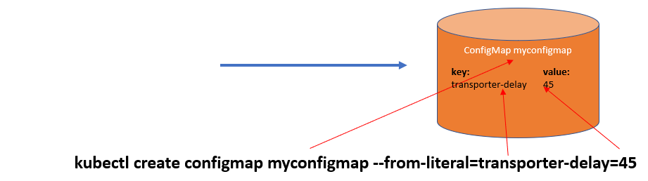
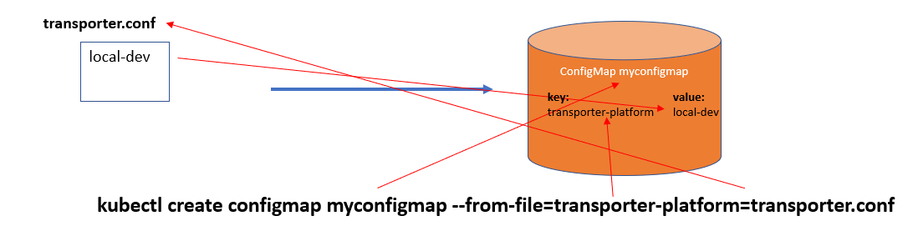
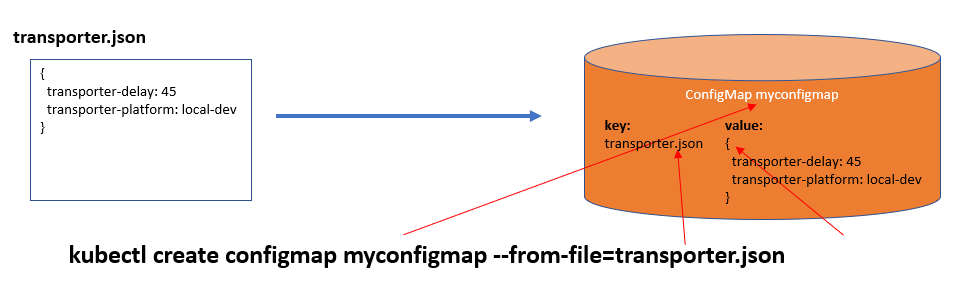
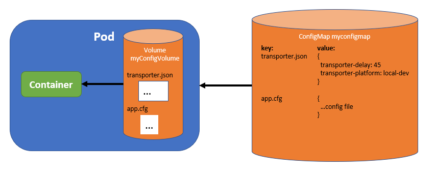

# 22. Volume configMap advanced: handling config files and directories

The previous, first lab on ConfigMaps has shown how simple configuration items can be mapped on operations and arguments. However. ConfigMap has more to offer! It can create its key-value pairs in the following ways:

**Literal**

A configMap with/from a literal entry:




**From file**

A configMap with an entry from a file:



**From configuration file**

A configMap with a complete configuration file entry:




**From configuration directory**

A configMap that takes entries from the files in a directory:


The configuration options that are shown above illustrate that the configMap mechanism is very flexible: it will most likely also cover your application's configuration requirements.

## Mount configMap into a Pod

The only part that is missing now in your toolkit is 'how to mount *only* the right file of the configMap in the right directory/file'.

The image below shows what we want to achieve:



We want to map the transporter.json file contants onto a file in the Container in the Pod.

The Pod's manifest file looks like below:

```bash
spec:
  containers:
  - image: some/image
    volumeMounts:
    - name: myconfigvolume
      mountPath: /etc/someconfig.json
      subPath: transporter.json
...

  volumes:
  - name: myconfigvolume
    configMap:
      name: myconfigmap
```

So, in the container, the *contents of the transporter.json key in myconfigmap* is mapped in the Container on the *file /etc/someconfig.json*.


## Exercises

Well, the commands are in the above figures, and the sample files are in the `lab 22` directory. Try and clean up!
