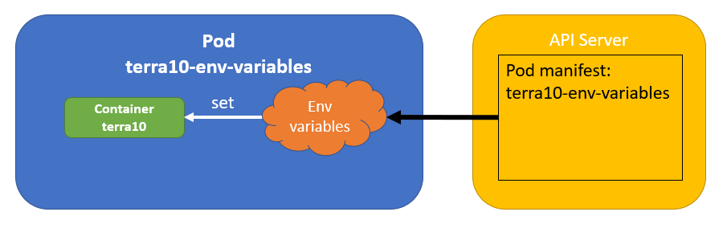
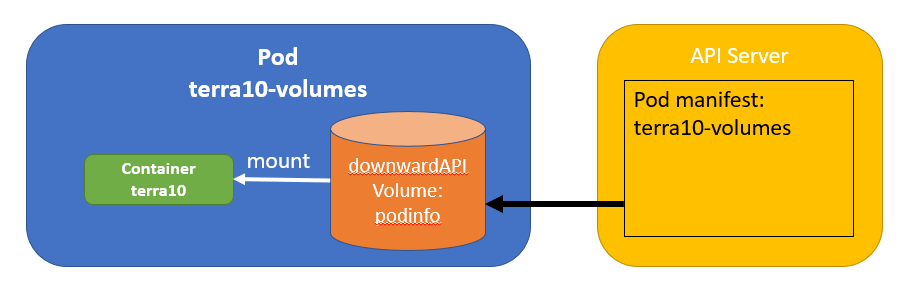

# 24. Volume downwardAPI: make downward API data available in plain text files

The Downward API can be used to expose Pod and Container fields to a running Container. These fields can be exposed as an environmen variable, or as a DownwardAPIVolumeFile. The Downward API supports the following information (this pretty much depends on the Kubernetes version: check for your version the ref documentation):

| Selector    |  Description    |  Env variables  | Volumes    |
|-------------|-----------------|-----------------|------------|
| metadata.name | The Pod's name | yes            | yes        |
| metadata.namespace | The Pod's namespace | yes  | yes        |
| metadata.labels | The Pod's labels |  -         | yes        |
| metadata.annotations | The Pod's annotations | - | yes       |
| status.podIP | The Pod's IP address | yes       | -          |
| spec.nodeName | The Name of the Node the Pod runs on | yes | - |
| spec.serviceAccountName | The name of the Service Account the Pod is running under | yes | - |
| limits.cpu    | CPU limits for each Container | yes | yes | 
| requests.cpu  | CPU requests for each Container | yes | yes | 
| limits.memory | Memory limits for each Container | yes | yes | 
| requests.memory | Memory requests for each Container | yes | yes | 

Most of them you should already know by now. The new ones are:

- *serviceAccountName*: when the Pod contacts the API Server, it authenticates using the serviceAccountName that it runs under
- *requests.cpu*: amount of cpu that is guaranteed to a Container
- *limits.cpu*: the maximum amount of cpu that a Container can get
- *requests.memory*: the amount of memory that is guaranteed to a Container
- *requests.limit*: the maximum amount of memory that a Container can get

In the above:

- *cpu* is measured in 'AWS vCPU', or the equivalent in your set-up. For example, a requests.cpu of 0.3 means that 0.3 of an AWS vCPU processor's time is reserved for that Container. Other expressions are possible, e.g. 300m (which is the same as 0.3)
- *memory* is measured with an integer, or using the suffixes like G, M, K, ...


** Downward API and environment variables

In this part, we will create a Pod and environment variables for the Downward API supported fields:



The manifest file can be found in directory `lab 24` under name `terra10-env-variables.yaml`:

```bash
apiVersion: v1
kind: Pod
metadata:
  name: terra10-env-variables                 # Pod name
spec:
  containers:
  - image: lgorissen/terra10
    name: terra10                             # Container name
    ports:
    - containerPort: 8080
      protocol: TCP
    env:                                      # start specification environment variables
      - name: MY_NODE_NAME                    # env variable for spec.nodeName
        valueFrom:
          fieldRef:
            fieldPath: spec.nodeName
      - name: MY_POD_NAME                     # env variable for metadata.name
        valueFrom:
          fieldRef:
            fieldPath: metadata.name
      - name: MY_POD_NAMESPACE                # env variable for metadata.nameSpace
        valueFrom:
          fieldRef:
            fieldPath: metadata.namespace
      - name: MY_POD_IP                       # env variable for status.podIP
        valueFrom:
          fieldRef:
            fieldPath: status.podIP
      - name: MY_POD_SERVICE_ACCOUNT          # env variable for spec.serviceAccountName
        valueFrom:
          fieldRef:
            fieldPath: spec.serviceAccountName
      - name: MY_CONTAINER_MEMORY_REQUEST     # env variable for requests.memory
        valueFrom:
          resourceFieldRef:
            containerName: terra10
            resource: requests.memory
            divisor: 1                        # divisor determines how to display value
      - name: MY_CONTAINER_MEMORY_LIMITS      # env variable for limits.memory
        valueFrom:
          resourceFieldRef:
            containerName: terra10
            resource: limits.memory
            divisor: 1                        # divisor determines how to display value
      - name: MY_CONTAINER_CPU_REQUESTS       # env variable for requests.cpu
        valueFrom:
          resourceFieldRef:
            containerName: terra10
            resource: requests.cpu
            divisor: 1m                       # divisor determines how to display value
      - name: MY_CONTAINER_CPU_LIMITS         # env variable for limits.cpu
        valueFrom:
          resourceFieldRef:
            containerName: terra10
            resource: limits.cpu
            divisor: 1m                       # divisor determines how to display value
```

Run and verify:

```bash
developer@developer-VirtualBox:~/projects/k4d/lab 24$ k create -f terra10-env-variables.yaml 
pod/terra10-env-variables created
developer@developer-VirtualBox:~/projects/k4d/lab 24$ k exec terra10-env-variables -it /bin/bash
root@terra10-env-variables:/# env | grep MY
MY_CONTAINER_CPU_LIMITS=3000
MY_POD_NAMESPACE=default
MY_CONTAINER_CPU_REQUESTS=0
MY_CONTAINER_MEMORY_LIMITS=4031442944
MY_POD_NAME=terra10-env-variables
MY_NODE_NAME=minikube
MY_POD_IP=172.17.0.14
MY_POD_SERVICE_ACCOUNT=default
MY_CONTAINER_MEMORY_REQUEST=0
root@terra10-env-variables:/# 
```


** Downward API and Volumes

In this part, we will create a Pod and a Volume for the Downward API supported fields:



The manifest file can be found in directory `lab 24` under name `terra10-volumes.yaml`:

```bash
apiVersion: v1
kind: Pod
metadata:
  name: terra10-volumes                          # Pod name
  labels:                                        # Add 2 labels
    planet: terra10-sub2
    transporter: local-11
  annotations:                                   # Add 2 annotations
    build: 20181029-01
    builder: LGO
spec:
  containers:
  - image: lgorissen/terra10
    name: terra10                                # Container name
    ports:
    - containerPort: 8080
      protocol: TCP
    volumeMounts:                                # mount podinfo Volume
      - name: podinfo                            # into Container
        mountPath: /etc/podinfo                  # on location /etc/podinfo
  volumes:
    - name: podinfo                              # specification of the podinfo Volume
      downwardAPI:                               # volume type: downwardAPI
        items:
          - path: "name"                         # file name holds metadata.name
            fieldRef:
              fieldPath: metadata.name
          - path: "namespace"                    # file namespace holds metadata.namespace
            fieldRef:
              fieldPath: metadata.namespace
          - path: "labels"                       # file labels holds metadata.labels
            fieldRef:                            # one line for each label
              fieldPath: metadata.labels
          - path: "annotations"                  # file annotations holds metadata.annotations
            fieldRef:                            # one line for each annotation
              fieldPath: metadata.annotations    
          - path: "limits.cpu"                   # file limits.cpu holds limits.cpu
            resourceFieldRef:
              containerName: terra10             # ... of Container terra10
              resource: limits.cpu
              divisor: 1m                        # ... using divisor 1m for displaying value
          - path: "requests.cpu"                 # file requests.cpu holds requests.cpu
            resourceFieldRef:
              containerName: terra10             # ... of Container terra10
              resource: requests.cpu
              divisor: 1m                        # ... using divisor 1m for displaying value
          - path: "limits.memory"                # file limits.memory holds limits.memory
            resourceFieldRef:
              containerName: terra10             # ... of Container terra10
              resource: limits.memory
              divisor: 1                         # ... using divisor 1 for displaying value
          - path: "requests.memory"              # file requests.memory holds request.memory
            resourceFieldRef:
              containerName: terra10             # ... of Container terra10
              resource: requests.memory
              divisor: 1                         # ... using divisor 1 for displaying value

```

Run and verify:

```bash
developer@developer-VirtualBox:~/projects/k4d/lab 24$ k create -f terra10-volumes.yaml  
pod/terra10-volumes created
developer@developer-VirtualBox:~/projects/k4d/lab 24$ k exec terra10-volumes -it bash
root@terra10-volumes:/# cd /etc/podinfo/
root@terra10-volumes:/etc/podinfo# ls
annotations  limits.cpu     name       requests.cpu
labels	     limits.memory  namespace  requests.memory
root@terra10-volumes:/etc/podinfo# more *
::::::::::::::
annotations
::::::::::::::
build="20181029-01"
builder="LGO"
kubernetes.io/config.seen="2018-10-29T21:17:34.829067628+01:00"
kubernetes.io/config.source="api"
::::::::::::::
labels
::::::::::::::
planet="terra10-sub2"
transporter="local-11"
::::::::::::::
limits.cpu
::::::::::::::
3000
::::::::::::::
limits.memory
::::::::::::::
4031442944
::::::::::::::
name
::::::::::::::
terra10-volumes
::::::::::::::
namespace
::::::::::::::
default
::::::::::::::
requests.cpu
::::::::::::::
0
::::::::::::::
requests.memory
::::::::::::::
0
root@terra10-volumes:/etc/podinfo# 
```

Clean up!
