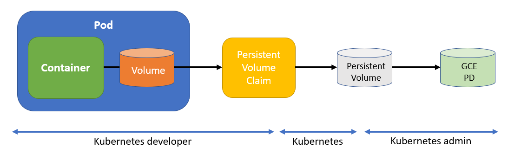
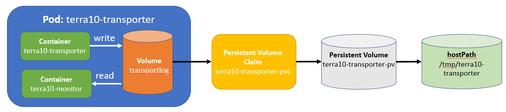

# 25. Persistent Volumes: hiding tech details from the developer

In all the labs about Volumes, we (well actually: I) skipped the network and Cloud Volume types. Labs for these types also require access to these types of Volumes, which may not be possible in the environment where you run your labs.

Nevertheles, let's hava a look at a manifest file for a Volume of type *gcePersistentDisk*, in a Pod specification:

```bash
apiVersion: v1
kind: Pod                               # this is a Pod specification 
metadata:
  name: test-pd                         # Pod name: test-pd
spec:
  containers:                           # Container specification
  - image: k8s.gcr.io/test-webserver
    name: test-container
    volumeMounts:                       # A Volume is mounted in the container
    - mountPath: /test-pd               # ... mountpoint is /test-pd
      name: test-volume                 # ... name of Volume is test-volume
  volumes:
  - name: test-volume                   # Start of specification of Volume test-volume
    # This GCE PD must already exist.
    gcePersistentDisk:                  # ... of type gcePersistentDisk
      pdName: my-data-disk              # ... name of the (existing) GCE PD 
      fsType: ext4                      # ... and its file type
```

The above example, is taken from the Kubernetes reference documentation, and is therefore correct ;-)

However, there are 2 things about this approach that we don't like:

1. The Volume specification has technical details that you normally don't want to bother the application developer with. Knowing technical details about storage is more a Kubernetes admin thingie...
2. The Pod specification is often considered to define the application. Now, if you want to run this application (Pod) on a different Kubernetes cluster that has different storage types, you need to change the Pod specification. Bwah.

As it turns out, the Kubernetes folks not only agreed on this, but they also helped us with a solution: Persistent Volumes! 



In the figure above:

**Kubernetes developer**

- Creates the Pod specification
- Defines a Volume in the Pod specification that refers to a Persistent Volume claim
- The Persistent Volume Claim object describes the storage that is requested
- As a result, the Pod specification has no Volume/storage implementation details

**Kubernetes admin**
 
 - Ensures that physical storage is available - in our case Cloud storage in the Google Cloud: GCE PD
 - Creates a Persistent Volume Kubernetes object that represents this storage
 - Note that a Persistent Volume is a resource on Cluster level, i.e. it does not belong to any Namespace
 
**Kubernetes**

- Kubernetes itself matches the Persistent Volume Claim with a corresponding Persistent Volume


## Manifest files for the GCE PD case

The Pod manifest that was used above, would transform to:

```bash
apiVersion: v1
kind: Pod                               # this is a Pod specification 
metadata:
  name: test-pd                         # Pod name: test-pd
spec:
  containers:                           # Container specification
  - image: k8s.gcr.io/test-webserver
    name: test-container
    volumeMounts:                       # A Volume is mounted in the container
    - mountPath: /test-pd               # ... mountpoint is /test-pd
      name: test-volume                 # ... name of Volume is test-volume
  volumes:
  - name: test-volume                   # Start of specification of Volume test-volume
    persistenVolumeClaim:               # this is the only change: refer to a 
      claimName: terra10-pvc            # ... persistentVolumeClaim
```


The Persistent Volume Claim describes what storage it needs:

```bash
apiVersion: v1
kind: PersistentVolumeClaim   # object type PersistentVolumeClaim
metadata:
  name: terra10-pvc           # pvc name is terra10-pvc
spec:
  accessModes:
    - ReadWriteOnce           # storage access mode: see below
  volumeMode: Filesystem      # see below
  resources:
    requests:
      storage: 8Gi            # storageSize
  storageClassName: ""        # see lab on dynamic volume provisioning
```

**accessMode**

The *accessMode* describes how the volume will be mounted on a node:

- ReadWriteOnce (RWO) – the volume can be mounted as read-write by a single node
- ReadOnlyMany (ROX) – the volume can be mounted read-only by many nodes
- ReadWriteMany (RWX) – the volume can be mounted as read-write by many nodes

**volumeMode**

The *volumeMode* distinguishes between raw block device (raw) or use a filesystem (filesystem)


The Persistent Volume describes the storage:

```bash
apiVersion: v1
kind: PersistentVolume        # type of storage
metadata:
  name: pv0001                # name of PV
spec:
  capacity:
    storage: 8Gi              # size
  accessModes:                # see description above
    - ReadWriteOnce           # read-write by single node
  gcePersistentDisk:          # the GCE storage
    fsType: ext4              # ... that should be present
    pdName: my-data-disk      # ... ask the k8s admin ;-)
```


## Kubernetes & matching PVC and PV

The example in the previous section describes a PVC and PV. When Kubernetes gets the PVC, it will have to select a matching PV. In our case, the selection would 'look for an 8GB file system with RWO access mode'. 

To guide this matching process, it is possible to add a label selector to the Persistent Volume Claim. This label selector will the specific a label query that will by used to determine what Persistent Volumes are considered for binding. For example:

```bash
  selector:                            # label selector helps with selecting the right Volume
    matchLabels:
      release: "stable"
    matchExpressions:
      - {key: environment, operator: In, values: [dev]}
```

## Lifespan of PVC and PV

It is important to understand the lifespan of PVC, PV and Pod. In general:

- The Persistent Volume is created by the k8s admin and ceases to exist when the admin deletes it.
- The Persistent Volume Claim is a Kubernetes object with it's own lifespan. It is created by the Kubernetes user and at some point deleted by the user. Upon deletion of the Persistent Volume Claim, the Persistent Volume will be recycled and can then be claimed by another PVC
- The Pod can mount a PVC and unmount it at the end of its lifespan. When the Pod unmounts the PVC, the PVC (and its data) remain present to be mounted by another Pod.

However, also other possibilities exist: it is possible to define a *reclaim policy* for a PV that defines different behaviour. Please consult the Kubernetes reference documentation.

## Storage is difficult!

There is a good reason why Persistent Volumes are introduced in Kubernetes: storage is difficult and in general requires knowledge that the average developer (no ... not you ... the others!) does not have. This lab only scratches the surface of Persistent Volumes. Sound advice: when designing the Storage for your application, get someone involved who has the right knowledge!


## Finally, a Lab exercise 
...Albeit a simple one...

Like earlier, we will not do a lab exercise with network or Cloud storage involved.

Instead, we will use the hostPath storage: it accesses the local file system on the Cluster Node. So, for production situations where you want to access local files (mostly system related) that could be OK. And for testing purposes. BuUT ... NOT for production purposes if you want to share data across Pods.

Anyway, what we want to make looks like:



This is pretty similar to the set-up we made in Lab 18, where the storage for the Pod was an emptyDir Volume. This time, we will use Persistent Volumes to create a more persistent storage.

Let's first have a look at the 3 manifest files that we need:

1. Persistent Volume: terra10-transporter-pv.yaml
2. Persistent Volume Claim: terra10-transporter-pvc.yaml
3. Pod: terra10-transporter.yaml

The manifest files can be found in the `lab 25` directory.

**Persistent Volume: terra10-transporter-pv.yaml**

The manifest looks like:

```bash
apiVersion: v1
kind: PersistentVolume                  # definition of a PersistentVolume
metadata:
  name: terra10-transporter-pv          # ... named terra10-transporter-pv
spec:                                   # specification of the Volume
  capacity:                             # capacity:
    storage: 1Gi                        # ... 1 Gi
  accessModes:                          # allowed accessModes:
    - ReadWriteOnce                     # read-write by a single node
    - ReadOnlyMany                      # read-only by many nodes
  persistentVolumeReclaimPolicy: Retain # allows for manual reclamation of the resource
  hostPath:
    path: /tmp/terra10-transporter      # path to part of local storage is used
```

Now, let's create the Persistent Volume:

```bash
developer@developer-VirtualBox:~/projects/k4d/lab 25$ k create -f terra10-transporter-pv.yaml 
persistentvolume/terra10-transporter-pv created
developer@developer-VirtualBox:~/projects/k4d/lab 25$ k get pv terra10-transporter-pv 
NAME                     CAPACITY   ACCESS MODES   RECLAIM POLICY   STATUS      CLAIM     STORAGECLASS   REASON    AGE
terra10-transporter-pv   1Gi        RWO,ROX        Retain           Available                                      11s
developer@developer-VirtualBox:~/projects/k4d/lab 25$ k describe pv terra10-transporter-pv 
Name:            terra10-transporter-pv
Labels:          <none>
Annotations:     <none>
Finalizers:      [kubernetes.io/pv-protection]
StorageClass:    
Status:          Available
Claim:           
Reclaim Policy:  Retain
Access Modes:    RWO,ROX
Capacity:        1Gi
Node Affinity:   <none>
Message:         
Source:
    Type:          HostPath (bare host directory volume)
    Path:          /tmp/terra10-transporter
    HostPathType:  
Events:            <none>
developer@developer-VirtualBox:~/projects/k4d/lab 25$
```


**Persistent Volume Claim: terra10-transporter-pvc.yaml**

The Persistent Volume Claim has the manifest file:

```bash
apiVersion: v1
kind: PersistentVolumeClaim      # definition of PersistentVolumeClaim
metadata:
  name: terra10-transporter-pvc  # name...
spec:
  resources:                     # definition of minimum resources for this Volume
    requests:                    # definition of compute resources
      storage: 1Gi               # how much storage is requird
  accessModes:
  - ReadWriteOnce                # Required acces mode: read-write by a single node
  storageClassName: ""           # you will learn about this in the next lab
```

Claim the Volume:

```bash
developer@developer-VirtualBox:~/projects/k4d/lab 25$ k create -f terra10-transporter-pvc.yaml 
persistentvolumeclaim/terra10-transporter-pvc created
developer@developer-VirtualBox:~/projects/k4d/lab 25$ k get pvc terra10-transporter-pvc 
NAME                      STATUS    VOLUME                   CAPACITY   ACCESS MODES   STORAGECLASS   AGE
terra10-transporter-pvc   Bound     terra10-transporter-pv   1Gi        RWO,ROX                       6s
developer@developer-VirtualBox:~/projects/k4d/lab 25$ k describe pvc terra10-transporter-pvc 
Name:          terra10-transporter-pvc
Namespace:     default
StorageClass:  
Status:        Bound
Volume:        terra10-transporter-pv
Labels:        <none>
Annotations:   pv.kubernetes.io/bind-completed=yes
               pv.kubernetes.io/bound-by-controller=yes
Finalizers:    [kubernetes.io/pvc-protection]
Capacity:      1Gi
Access Modes:  RWO,ROX
Events:        <none>
developer@developer-VirtualBox:~/projects/k4d/lab 25$
```

Note that the previously created Permanent Volume *terra10-transporter-pv* is immediately bound to this claim!


**Pod: terra10-transporter.yaml**

Now that both the Permanent Volume Claim and the Permanent Volume are created, it is time to create the Pod. First, have a look at its manifest file:

```bash
apiVersion: v1
kind: Pod
metadata:
  name: terra10-transporter                # definition of Pod terra10-transporter
spec:
  containers:                              # ... with 2 Containers:
  - image: lgorissen/terra10-transporter   # 1. terra10-transporter Container
    name: terra10-transporter
    volumeMounts:
    - name: transportlog                   # mounts transportlog Volume
      mountPath: /tmp                      # same like before
    ports:
    - containerPort: 8092
      protocol: TCP
  - image: lgorissen/terra10-monitor       # 2. terra10-monitor Container
    name: terra10-monitor
    volumeMounts:
    - name: transportlog                   # mounts transportlog Volume
      mountPath: /var/log                  # same like before
      readOnly: true
    ports:
    - containerPort: 8090
      protocol: TCP
  volumes:                                 # Volume definition
  - name: transportlog                     # ... for the transportlog Volume
    persistentVolumeClaim:                 # ... is a PersistentVolumeClaim
      claimName: terra10-transporter-pvc   # ... with name terra10-transporter-pvc

```

Note how similar this manifest is to the one for Lab 18: only the Volume specification has changed!

Go!

```bash
developer@developer-VirtualBox:~/projects/k4d/lab 25$ k create -f terra10-transporter.yaml 
pod/terra10-transporter created
developer@developer-VirtualBox:~/projects/k4d/lab 25$ k get pod terra10-transporter
NAME                  READY     STATUS    RESTARTS   AGE
terra10-transporter   2/2       Running   0          8s
developer@developer-VirtualBox:~/projects/k4d/lab 25$ k describe pod terra10-transporter
Name:         terra10-transporter
Namespace:    default
Node:         minikube/10.0.2.15
Start Time:   Wed, 31 Oct 2018 22:07:31 +0100
Labels:       <none>
Annotations:  <none>
Status:       Running
IP:           172.17.0.12
Containers:
  terra10-transporter:
    Container ID:   docker://54039ac11adb49ceb620befac9c6bc4a3cb53ca761854ffaa08c07d28037eeb9
    Image:          lgorissen/terra10-transporter
    Image ID:       docker-pullable://lgorissen/terra10-transporter@sha256:df80b324cf016afdfde25f40be57a4c7ca807111c40f5e7545a166606a8c5138
    Port:           8092/TCP
    Host Port:      0/TCP
    State:          Running
      Started:      Wed, 31 Oct 2018 22:07:34 +0100
    Ready:          True
    Restart Count:  0
    Environment:    <none>
    Mounts:
      /tmp from transportlog (rw)
      /var/run/secrets/kubernetes.io/serviceaccount from default-token-7sddz (ro)
  terra10-monitor:
    Container ID:   docker://0e99fc6056953074d2455fd2c779f973172fe4fcdbb798424094d89885702237
    Image:          lgorissen/terra10-monitor
    Image ID:       docker-pullable://lgorissen/terra10-monitor@sha256:a6d56bd96408b38ebcf0769408ac822ec8324e6a141695067eb5d163030a6499
    Port:           8090/TCP
    Host Port:      0/TCP
    State:          Running
      Started:      Wed, 31 Oct 2018 22:07:36 +0100
    Ready:          True
    Restart Count:  0
    Environment:    <none>
    Mounts:
      /var/log from transportlog (ro)
      /var/run/secrets/kubernetes.io/serviceaccount from default-token-7sddz (ro)

...

Volumes:
  transportlog:
    Type:       PersistentVolumeClaim (a reference to a PersistentVolumeClaim in the same namespace)
    ClaimName:  terra10-transporter-pvc
    ReadOnly:   false
  default-token-7sddz:
    Type:        Secret (a volume populated by a Secret)
    SecretName:  default-token-7sddz
    Optional:    false

...
```

Note above:

- the Mounts with each Container, and
- the Volume itself

If you have come this far, you should have a working Pod, so... test!

## Test

First, test the functionality of the Pod:

```bash
developer@developer-VirtualBox:~/projects/k4d/lab 25$ curl '172.17.0.12:8090/?name=Luc&from=DenBosch&to=Moon'
Hello, Luc will be transported from DenBosch to Moon using the Terra10 transporter service
developer@developer-VirtualBox:~/projects/k4d/lab 25$ curl 172.17.0.12:8092
Luc is transported from DenBosch to Moon
developer@developer-VirtualBox:~/projects/k4d/lab 25$ 
```

The transporter and monitor functionality are working. Now check the transporter log file on the Node file system:

```bash
developer@developer-VirtualBox:~/projects/k4d/lab 25$ more /tmp/terra10-transporter/transporter.log 
Luc is transported from DenBosch to Moon
developer@developer-VirtualBox:~/projects/k4d/lab 25$
```

Just to be a nuisance, let's stop the Containers and then check what the new Containers do. The Container IDs can be retrieved in the Pod's description above:

```bash
developer@developer-VirtualBox:~/projects/k4d/lab 25$ docker stop 54039
54039
developer@developer-VirtualBox:~/projects/k4d/lab 25$ docker stop 0e99f
0e99f
developer@developer-VirtualBox:~/projects/k4d/lab 25$ curl '172.17.0.12:8090/?name=Elvis&from=DenBosch&to=Moon'
Hello, Elvis will be transported from DenBosch to Moon using the Terra10 transporter service
developer@developer-VirtualBox:~/projects/k4d/lab 25$ curl 172.17.0.12:8092
Luc is transported from DenBosch to Moon
Elvis is transported from DenBosch to Moon
developer@developer-VirtualBox:~/projects/k4d/lab 25$ more /tmp/terra10-transporter/transporter.log 
Luc is transported from DenBosch to Moon
Elvis is transported from DenBosch to Moon
developer@developer-VirtualBox:~/projects/k4d/lab 25$ 
```

Just what we expected: the new Containers will use the same Volume.

Now we delete the Pod and then re-create it again:

```bash
developer@developer-VirtualBox:~/projects/k4d/lab 25$ k delete pod terra10-transporter
pod "terra10-transporter" deleted
developer@developer-VirtualBox:~/projects/k4d/lab 25$ k create -f terra10-transporter.yaml 
pod/terra10-transporter created
developer@developer-VirtualBox:~/projects/k4d/lab 25$ curl '172.17.0.12:8090/?name=JimmyHoffa&from=DenBosch&to=Moon'
Hello, JimmyHoffa will be transported from DenBosch to Moon using the Terra10 transporter service
developer@developer-VirtualBox:~/projects/k4d/lab 25$ curl 172.17.0.12:8092
Luc is transported from DenBosch to Moon
Elvis is transported from DenBosch to Moon
JimmyHoffa is transported from DenBosch to Moon
developer@developer-VirtualBox:~/projects/k4d/lab 25$ 
```

Final tests: when we delete Pod, PVC and PV, the transport.log file should still be present, due to the *persistentVolumeReclaimPolicy* that was set to *Retain*:

```bash
developer@developer-VirtualBox:~/projects/k4d/lab 25$ k delete pod terra10-transporter
pod "terra10-transporter" deleted
developer@developer-VirtualBox:~/projects/k4d/lab 25$ k delete pvc terra10-transporter-pvc 
persistentvolumeclaim "terra10-transporter-pvc" deleted
developer@developer-VirtualBox:~/projects/k4d/lab 25$ k describe pv terra10-transporter-pv 
Name:            terra10-transporter-pv
Labels:          <none>
Annotations:     pv.kubernetes.io/bound-by-controller=yes
Finalizers:      [kubernetes.io/pv-protection]
StorageClass:    
Status:          Released
Claim:           default/terra10-transporter-pvc
Reclaim Policy:  Retain
Access Modes:    RWO,ROX
Capacity:        1Gi
Node Affinity:   <none>
Message:         
Source:
    Type:          HostPath (bare host directory volume)
    Path:          /tmp/terra10-transporter
    HostPathType:  
Events:            <none>
developer@developer-VirtualBox:~/projects/k4d/lab 25$ k delete pv terra10-transporter-pv 
persistentvolume "terra10-transporter-pv" deleted
developer@developer-VirtualBox:~/projects/k4d/lab 25$ more /tmp/terra10-transporter/transporter.log 
Luc is transported from DenBosch to Moon
Elvis is transported from DenBosch to Moon
JimmyHoffa is transported from DenBosch to Moon
developer@developer-VirtualBox:~/projects/k4d/lab 25$
```


Phew ... long Lab it was.