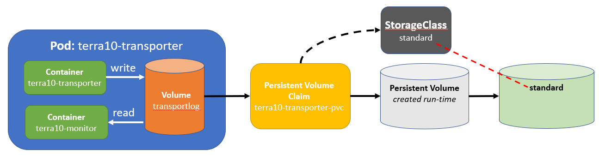

# 26. Dynamic Volume Provisioning: hiding the developer from the admin

In the previous lab, we learned how Persistent Volumes and Persistent Volume Claims split the work of the developer and the admin. The admin deals with the Storage specifics and prepares are Persistent Volume. The developer does not need to know the Storage specifics, but only has to make a Persistent Volume Claim to use the Persistent Volume. 

Dynamic Volume Provisioning takes the developer-admin de-coupling even one step further. In the above scenario, the admin still has to provision a volume up front. However, with Dynamic Volume Provisioning, the user can create Storage Volumes on demand. 

Dynamic Provisioning centers around the so-called StorageClass objects. A **StorageClass** object specifies:

- a **Volume plugin**, a.k.a **Provisioner**: provisions a Volume
- a **set of parameters**: passed on to the Provisioner when provisioning 


In a figure:


The admin can define different StorageClass objects and is therefore still in control of the storage. However, the user can create a StorageClass based Volume whenever he wants.


## StorageClass example

As we restrict our labs to using minikube, the labs do not use Cloud or network storage. Nevertheless, we want to show you a StorageClass example for the Google Cloud:

```bash
kind: StorageClass                   # definition of a StorageClass
apiVersion: storage.k8s.io/v1
metadata:
  name: slow                         # name of the StorageClass
provisioner: kubernetes.io/gce-pd    # provisioner plug-in: 
parameters:
  type: pd-standard                  # storage type: standard persistent disk
  replication-type: regional-pd      # regional persistent disk
```

## StorageClass - hostPath

Now, lets do a minikube example. First, look at the available StorageClass objects:

```bash
developer@developer-VirtualBox:~/projects/k4d/lab 26/img$ kubectl get sc
NAME                 PROVISIONER                AGE
standard (default)   k8s.io/minikube-hostpath   29d
developer@developer-VirtualBox:~/projects/k4d/lab 26/img$ kubectl describe sc standard 
Name:            standard
IsDefaultClass:  Yes
Annotations:     kubectl.kubernetes.io/last-applied-configuration={"apiVersion":"storage.k8s.io/v1","kind":"StorageClass","metadata":{"annotations":{"storageclass.beta.kubernetes.io/is-default-class":"true"},"labels":{"addonmanager.kubernetes.io/mode":"Reconcile"},"name":"standard","namespace":""},"provisioner":"k8s.io/minikube-hostpath"}
,storageclass.beta.kubernetes.io/is-default-class=true
Provisioner:           k8s.io/minikube-hostpath
Parameters:            <none>
AllowVolumeExpansion:  <unset>
MountOptions:          <none>
ReclaimPolicy:         Delete
VolumeBindingMode:     Immediate
Events:                <none>
developer@developer-VirtualBox:~/projects/k4d/lab 26/img$
```

Well, that is a simple StorageClass. You can see amongst others the Provisioner name, the ReclaimPolicy and that is has no Parameters. 

In our example, we will use this **standard** StorageClass to create the configuration:



**Create the PVC**

First, create the Persistent Volume Claim by referencing the StorageClass standard in the manifest file `terra10-transporter-pvc.yaml`. The manifest file can - as usual - be found in the `lab 26` directory:

```bash
apiVersion: v1
kind: PersistentVolumeClaim
metadata:
  name: terra10-transporter-pvc  # name of the PVC
spec:
  resources:
    requests:
      storage: 1Gi
  accessModes:
  - ReadWriteOnce
  storageClassName: standard     # name of the StorageClass that is to be used
```

Creating the PVC:

```bash
developer@developer-VirtualBox:~/projects/k4d/lab 26$ kubectl create -f terra10-transporter-pvc.yaml 
persistentvolumeclaim/terra10-transporter-pvc created
developer@developer-VirtualBox:~/projects/k4d/lab 26$ kubectl get pvc
NAME                      STATUS    VOLUME                                     CAPACITY   ACCESS MODES   STORAGECLASS   AGE
terra10-transporter-pvc   Bound     pvc-6f61878e-e069-11e8-9408-0800276251a2   1Gi        RWO            standard       5s
developer@developer-VirtualBox:~/projects/k4d/lab 26$ kubectl describe pvc terra10-transporter-pvc 
Name:          terra10-transporter-pvc
Namespace:     default
StorageClass:  standard
Status:        Bound
Volume:        pvc-6f61878e-e069-11e8-9408-0800276251a2
Labels:        <none>
Annotations:   control-plane.alpha.kubernetes.io/leader={"holderIdentity":"af6d55ea-e04f-11e8-88e1-0800276251a2","leaseDurationSeconds":15,"acquireTime":"2018-11-04T19:40:11Z","renewTime":"2018-11-04T19:40:17Z","lea...
               pv.kubernetes.io/bind-completed=yes
               pv.kubernetes.io/bound-by-controller=yes
               volume.beta.kubernetes.io/storage-provisioner=k8s.io/minikube-hostpath
Finalizers:    [kubernetes.io/pvc-protection]
Capacity:      1Gi
Access Modes:  RWO
Events:
  Type    Reason                 Age               From                                                           Message
  ----    ------                 ----              ----                                                           -------
  Normal  ExternalProvisioning   7s (x3 over 11s)  persistentvolume-controller                                    waiting for a volume to be created, either by external provisioner "k8s.io/minikube-hostpath" or manually created by system administrator
  Normal  Provisioning           7s                k8s.io/minikube-hostpath af6d55ea-e04f-11e8-88e1-0800276251a2  External provisioner is provisioning volume for claim "default/terra10-transporter-pvc"
  Normal  ProvisioningSucceeded  7s                k8s.io/minikube-hostpath af6d55ea-e04f-11e8-88e1-0800276251a2  Successfully provisioned volume pvc-6f61878e-e069-11e8-9408-0800276251a2
developer@developer-VirtualBox:~/projects/k4d/lab 26$
```

**Create the Pod**

The Pod that uses the PVC is the same as in the previous lab:

```bash
apiVersion: v1
kind: Pod
metadata:
  name: terra10-transporter                # definition of Pod terra10-transporter
spec:
  containers:                              # ... with 2 Containers:
  - image: lgorissen/terra10-transporter   # 1. terra10-transporter Container
    name: terra10-transporter
    volumeMounts:
    - name: transportlog                   # mounts transportlog Volume
      mountPath: /tmp                      # same like before
    ports:
    - containerPort: 8092
      protocol: TCP
  - image: lgorissen/terra10-monitor       # 2. terra10-monitor Container
    name: terra10-monitor
    volumeMounts:
    - name: transportlog                   # mounts transportlog Volume
      mountPath: /var/log                  # same like before
      readOnly: true
    ports:
    - containerPort: 8090
      protocol: TCP
  volumes:                                 # Volume definition
  - name: transportlog                     # ... for the transportlog Volume
    persistentVolumeClaim:                 # ... is a PersistentVolumeClaim
      claimName: terra10-transporter-pvc   # ... with name terra10-transporter-pvc
```

Create the Pod:

```bash
developer@developer-VirtualBox:~/projects/k4d/lab 26$ kubectl create -f terra10-transporter.yaml 
pod/terra10-transporter created
developer@developer-VirtualBox:~/projects/k4d/lab 26$ kubectl get pod terra10-transporter 
NAME                  READY     STATUS    RESTARTS   AGE
terra10-transporter   2/2       Running   0          9s
developer@developer-VirtualBox:~/projects/k4d/lab 26$ 
```

Test it:

```bash
developer@developer-VirtualBox:~/projects/k4d/lab 26$ kubectl describe pod terra10-transporter | grep "^IP:"
IP:           172.17.0.6
developer@developer-VirtualBox:~/projects/k4d/lab 26$ curl '172.17.0.6:8090/?name=Luc&from=DenBosch&to=Moon'
Hello, Luc will be transported from DenBosch to Moon using the Terra10 transporter service
developer@developer-VirtualBox:~/projects/k4d/lab 26$ curl 172.17.0.6:8092
Luc is transported from DenBosch to Moon
developer@developer-VirtualBox:~/projects/k4d/lab 26$
```

Check the file system:

```bash
developer@developer-VirtualBox:~/projects/k4d/lab 26$ kubectl describe pv pvc-6f61878e-e069-11e8-9408-0800276251a2 
Name:            pvc-6f61878e-e069-11e8-9408-0800276251a2
Labels:          <none>
Annotations:     hostPathProvisionerIdentity=af6d55a9-e04f-11e8-88e1-0800276251a2
                 pv.kubernetes.io/provisioned-by=k8s.io/minikube-hostpath
Finalizers:      [kubernetes.io/pv-protection]
StorageClass:    standard
Status:          Bound
Claim:           default/terra10-transporter-pvc
Reclaim Policy:  Delete
Access Modes:    RWO
Capacity:        1Gi
Node Affinity:   <none>
Message:         
Source:
    Type:          HostPath (bare host directory volume)
    Path:          /tmp/hostpath-provisioner/pvc-6f61878e-e069-11e8-9408-0800276251a2
    HostPathType:  
Events:            <none>
developer@developer-VirtualBox:~/projects/k4d/lab 26$ more /tmp/hostpath-provisioner/pvc-6f61878e-e069-11e8-9408-0800276251a2/transporter.log 
Luc is transported from DenBosch to Moon
developer@developer-VirtualBox:~/projects/k4d/lab 26$ 
```

**Clean up?!**

You can do some additional tests, to check how the Persistent Volume behaves when the Persistent Volume Claim is deleted. It is different as for the StorageClass standard, the Retain Policy is **delete**...:

```bash
developer@developer-VirtualBox:~/projects/k4d/lab 26$ kubectl delete pod terra10-transporter 
pod "terra10-transporter" deleted
developer@developer-VirtualBox:~/projects/k4d/lab 26$ kubectl delete pvc terra10-transporter-pvc 
persistentvolumeclaim "terra10-transporter-pvc" deleted
developer@developer-VirtualBox:~/projects/k4d/lab 26$ ls -al /tmp/hostpath-provisioner/
total 28
drwxr-xr-x  2 root root  4096 nov  4 21:00 .
drwxrwxrwt 17 root root 20480 nov  4 21:00 ..
developer@developer-VirtualBox:~/projects/k4d/lab 26$
```

Indeed, the Volume is deleted!

And now ...clean up?!

