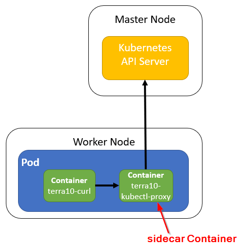

# 29. Kubernetes API Server: curl and a sidecar Container

The DownwardAPI volume provides access to some metadata of a Pod and its Containers. You will want to talk directly to the Kubernetes API Server!

We will show several ways to access the Kubernetes API Server:

- Use *curl and the kubectl proxy*
- Use *curl - from within a Pod*
- Use *curl - and a sidecar Container*
- Use *client libraries*

All-in-all, that should give you enough tools to handle your requirements.

## Curl and a sidecar Container - why?

This lab will show how to access the Kubernetes API from within a Pod, using curl and a sidecar Container. The sidecar Container `terra10-kubectl-proxy` will act as a proxy server that can be used to access the Kubernetes API Server. It contains all the details for accessing the Kubernetes API Server, thus hiding these details from the other Container(s) in the Pod.

The set-up for this lab will be:



The set-up shows a Pod with a 'sidecar Container'.


## The sidecar Container - how?

The sidecar Container that we will use will have to run a proxy for accessing the Kubernetes API Server. The Dockerfile can be found in the location `lab 29/terra10-kubectl-proxy`:

```bash
FROM alpine
RUN wget -O /kubectl https://storage.googleapis.com/kubernetes-release/release/v1.11.0/bin/linux/amd64/kubectl && \
    chmod +x /kubectl
ADD kubectl-proxy.sh /kubectl-proxy.sh
ENTRYPOINT /kubectl-proxy.sh
```

The Container:

- is based on the alpine image
- downloads kubectl
- adds the kubectl-proxy.sh script
- runs the kubectl-proxy.sh script upon start

The kubectl-proxy.sh script:

```bash
#!/bin/sh

API_SERVER="https://$KUBERNETES_SERVICE_HOST:$KUBERNETES_SERVICE_PORT"
CA_CRT="/var/run/secrets/kubernetes.io/serviceaccount/ca.crt"
TOKEN="$(cat /var/run/secrets/kubernetes.io/serviceaccount/token)"

/kubectl proxy --server="$API_SERVER" --certificate-authority="$CA_CRT" --token="$TOKEN" --accept-paths='^.*'
```
It starts the proxy, using the signing certificate, the API Server addressing and service account Token that are present in the Container. Nice.

You don't have to build the Container image yourself, it is available as `lgorissen/terra10-kubectl-proxy`.


## The sidecar Container in action

Now it's time to use the sidecar Container in a Pod, like the set-up shown at the start of the Lab.

For this, we will use a Pod (definition) that has:

- terra10-kubectl-proxy Container: the sidecar for access to the Kubernetes API Server
- terra10-curl Container: for curl via the sidecar to the Kubernetes API Server
 
The Pod's manifest file is named `apiserver-via-sidecar.yaml` and can be found in the `lab 29` directory:

```bash
apiVersion: v1
kind: Pod
metadata:
  name: apiserver-via-sidecar              # Pod name
spec:
  containers:
  - name: main                             # container main for curl
    image: lgorissen/terra10-curl
    command: ["sleep", "9999999"]          # keep container main running
  - name: sidecar                          # sidecar container
    image: lgorissen/terra10-kubectl-proxy
```

Let's put it to work:

```bash
developer@developer-VirtualBox:~/projects/k4d/lab 29$ k create -f apiserver-via-sidecar.yaml 
pod/apiserver-via-sidecar created
developer@developer-VirtualBox:~/projects/k4d/lab 29$ k get pod
NAME                    READY     STATUS    RESTARTS   AGE
apiserver-via-sidecar   2/2       Running   0          11s
developer@developer-VirtualBox:~/projects/k4d/lab 29$ k exec -it apiserver-via-sidecar -c main /bin/sh
/ #
```

Now, we are in the main container, we can use the sidecar container for querying the Kubernetes API Server. To make our life even more easy, remember that all the Containers in a Pod share the same network interfaces. So, you can use *localhost* to access the proxy in its default port *8001*. Continue in Container *main*:

```bash
/ # curl localhost:8001/api
{
  "kind": "APIVersions",
  "versions": [
    "v1"
  ],
  "serverAddressByClientCIDRs": [
    {
      "clientCIDR": "0.0.0.0/0",
      "serverAddress": "10.0.2.15:8443"
    }
  ]
}/ #
```

more advanced, look at your own Pod:

```bash
/ # curl localhost:8001/api/v1/namespaces/default/pods/apiserver-via-sidecar
{
  "kind": "Pod",
  "apiVersion": "v1",
  "metadata": {
    "name": "apiserver-via-sidecar",
    "namespace": "default",
    "selfLink": "/api/v1/namespaces/default/pods/apiserver-via-sidecar",
    "uid": "0dcc5db4-e4cf-11e8-b407-0800276251a2",
    "resourceVersion": "235080",
    "creationTimestamp": "2018-11-10T09:57:37Z"
  },
  "spec": {
    "volumes": [
      {
        "name": "default-token-7sddz",
        "secret": {
          "secretName": "default-token-7sddz",
          "defaultMode": 420
        }
      }
    ],
    "containers": [
      {
        "name": "main",
        "image": "lgorissen/terra10-curl",
        "command": [
          "sleep",
          "9999999"
        ],
...        
```

Clean up!
