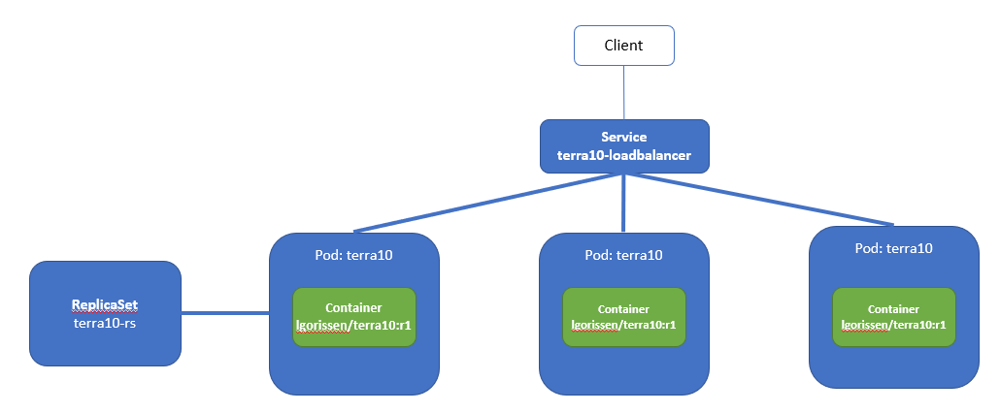
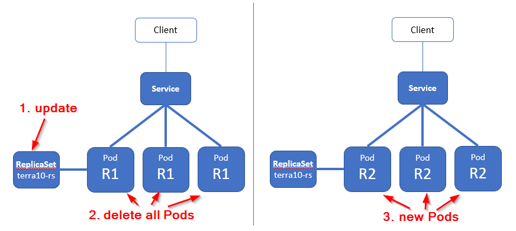
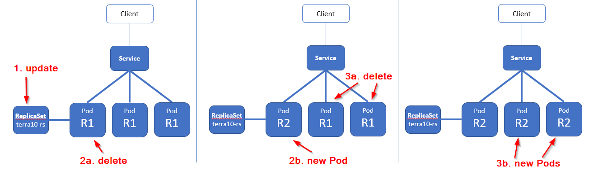
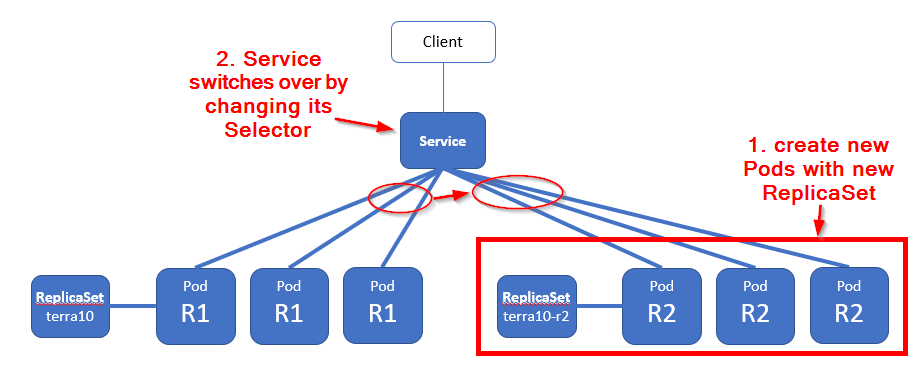

# 31. Deployments: manual

In real life, your applications will continuously evolve: new versions will become available. New versions means deployment, and there are various strategies to do that. These strategies will usually have to take into account:

- availability: does the application have to be available at all times
- upgrade time: how much time can the upgrade take
- available platform resources: are there enough resources to run the old and new versions in parallel
- backward compatibility: is it possible to have a mix of old and new versions in parallel

A running Pod itself can't be upgraded: Pods will allways run according to the template that they have been started with. Taking this into account, there are 3 main strategy options:

1. Delete the old Pods and then create the new Pods
2. Gradually delete old Pods and create new Pods
3. Create the new Pods and then switch the Service over to the new Pods

This lab will cover how the above 3 strategies can be performed ... manually.


## Basic Set-up - the starting point

The set-up that we will start the upgrade scenario's with looks like:



The set-up requires a ReplicaSet manifest file:

```bash
apiVersion: apps/v1beta2
kind: ReplicaSet
metadata:
  name: terra10-rs
spec:
  replicas: 3
  selector:
    matchExpressions:
      - key: app
        operator: In
        values:
         - terra10
  template:
    metadata:
      labels:
        app: terra10
    spec:
      containers:
      - name: terra10
        image: lgorissen/terra10:r1   # note the image label r1
```

and a Service manifest file:

```bash
apiVersion: v1
kind: Service
metadata:
  name: terra10-loadbalancer
spec:
  type: LoadBalancer
  ports:
  - port: 80
    targetPort: 8080
  selector:
    app: terra10

```

The files can be found in the `lab 31` director as `terra10-replicationset.yaml` and `terra10-service.yaml`.

Start the ReplicaSet and Service:

```bash
developer@developer-VirtualBox:~/projects/k4d/lab 31$ k create -f terra10-replicationset.yaml 
replicaset.apps/terra10-rs created
developer@developer-VirtualBox:~/projects/k4d/lab 31$ k create -f terra10-service-loadbalancer.yaml 
service/terra10-loadbalancer created
developer@developer-VirtualBox:~/projects/k4d/lab 31$ k get pod
NAME               READY     STATUS    RESTARTS   AGE
terra10-rs-bz6sf   1/1       Running   0          31s
terra10-rs-gn57x   1/1       Running   0          31s
terra10-rs-pdb9s   1/1       Running   0          31s
developer@developer-VirtualBox:~/projects/k4d/lab 31$ k get rs
NAME         DESIRED   CURRENT   READY     AGE
terra10-rs   3         3         3         37s
developer@developer-VirtualBox:~/projects/k4d/lab 31$ k get service
NAME                   TYPE           CLUSTER-IP     EXTERNAL-IP   PORT(S)        AGE
kubernetes             ClusterIP      10.96.0.1      <none>        443/TCP        35d
terra10-loadbalancer   LoadBalancer   10.110.47.57   <pending>     80:31647/TCP   32s
developer@developer-VirtualBox:~/projects/k4d/lab 31$ 
```
Test:

```bash
developer@developer-VirtualBox:~/projects/k4d/lab 31$ k describe service terra10-loadbalancer 
Name:                     terra10-loadbalancer
Namespace:                default
Labels:                   <none>
Annotations:              <none>
Selector:                 app=terra10
Type:                     LoadBalancer
IP:                       10.110.47.57
Port:                     <unset>  80/TCP
TargetPort:               8080/TCP
NodePort:                 <unset>  31647/TCP
Endpoints:                172.17.0.4:8080,172.17.0.6:8080,172.17.0.7:8080
Session Affinity:         None
External Traffic Policy:  Cluster
Events:                   <none>
developer@developer-VirtualBox:~/projects/k4d/lab 31$ curl 10.110.47.57:80
Hello, you landed on Terra10 (version r1) and host terra10-rs-gn57x welcomes you!
developer@developer-VirtualBox:~/projects/k4d/lab 31$ 
```

Test in a curl loop:

```bash
developer@developer-VirtualBox:~/projects/k4d/lab 31$ while true; do curl 10.110.47.57:80;sleep 2; done
Hello, you landed on Terra10 (version r1) and host terra10-rs-gn57x welcomes you!
Hello, you landed on Terra10 (version r1) and host terra10-rs-gn57x welcomes you!
Hello, you landed on Terra10 (version r1) and host terra10-rs-pdb9s welcomes you!
Hello, you landed on Terra10 (version r1) and host terra10-rs-gn57x welcomes you!
Hello, you landed on Terra10 (version r1) and host terra10-rs-gn57x welcomes you!
Hello, you landed on Terra10 (version r1) and host terra10-rs-bz6sf welcomes you!
Hello, you landed on Terra10 (version r1) and host terra10-rs-gn57x welcomes you!
^C
developer@developer-VirtualBox:~/projects/k4d/lab 31$
```
And watch that the Service load balances over the 3 available Pods.


## Manual upgrade (1) - delete old Pods, create new Pods

Now, let's upgrade our set-up to use a new version of the Pod, that uses the version r2 of the Container. We will:

- update the ReplicaSet definition to use the new Container image
- delete all existing Pods



Meanwhile, in a separate window we will run the *curl test loop* to see what is happening.

First, start the test loop:

```bash
developer@developer-VirtualBox:~/projects/k4d/lab 31$ while true; do curl 10.110.47.57:80;sleep 2; done
Hello, you landed on Terra10 (version r1) and host terra10-rs-pdb9s welcomes you!
Hello, you landed on Terra10 (version r1) and host terra10-rs-bz6sf welcomes you!
Hello, you landed on Terra10 (version r1) and host terra10-rs-pdb9s welcomes you!
Hello, you landed on Terra10 (version r1) and host terra10-rs-bz6sf welcomes you!
Hello, you landed on Terra10 (version r1) and host terra10-rs-pdb9s welcomes you!
Hello, you landed on Terra10 (version r1) and host terra10-rs-gn57x welcomes you!
Hello, you landed on Terra10 (version r1) and host terra10-rs-bz6sf welcomes you!
Hello, you landed on Terra10 (version r1) and host terra10-rs-pdb9s welcomes you!
```
Just keep it running.

Now, edit the ReplicaSet definition:

```bash
developer@developer-VirtualBox:~/projects/k4d/lab 31$ k edit replicaset terra10-rs
```
... and change the image tag to **r2**:

```bash
...
        app: terra10
    spec:
      containers:
      - image: lgorissen/terra10:r2
        imagePullPolicy: IfNotPresent
        name: terra10
        resources: {}
...
```
Save the file.

Whe looking at your test window, you can see that still the same *r1* Pods are responding. Which is what we expected, as the ReplicaSet will use the new template only when creating new Pods!

Now it is time to do the 'real' upgrade. Let's delete all running Pods, and watch the ReplicaSet create new Pods.

**Delete**

Delete all the Pods:
```bash
developer@developer-VirtualBox:~/projects/k4d/lab 31$ k delete pod -l app=terra10
pod "terra10-rs-bz6sf" deleted
pod "terra10-rs-gn57x" deleted
pod "terra10-rs-pdb9s" deleted
developer@developer-VirtualBox:~/projects/k4d/lab 31$
```

**... and watch the test window**

```bash
Hello, you landed on Terra10 (version r1) and host terra10-rs-pdb9s welcomes you!
Hello, you landed on Terra10 (version r1) and host terra10-rs-gn57x welcomes you!
Hello, you landed on Terra10 (version r1) and host terra10-rs-pdb9s welcomes you!
Hello, you landed on Terra10 (version r1) and host terra10-rs-bz6sf welcomes you!
Hello, you landed on Terra10 (version r1) and host terra10-rs-bz6sf welcomes you!
Hello, you landed on Terra10 (version r1) and host terra10-rs-pdb9s welcomes you!
Hello, you landed on Terra10 (version r1) and host terra10-rs-pdb9s welcomes you!
Hello, you landed on Terra10 (version r1) and host terra10-rs-gn57x welcomes you!
curl: (7) Failed to connect to 10.110.47.57 port 80: Connection refused
curl: (7) Failed to connect to 10.110.47.57 port 80: Connection refused
Hello, you landed on Terra10 (version r2) and host terra10-rs-z8r4p welcomes you!
Hello, you landed on Terra10 (version r2) and host terra10-rs-thfcz welcomes you!
Hello, you landed on Terra10 (version r2) and host terra10-rs-thfcz welcomes you!
Hello, you landed on Terra10 (version r2) and host terra10-rs-zmzz8 welcomes you!
Hello, you landed on Terra10 (version r2) and host terra10-rs-z8r4p welcomes you!
Hello, you landed on Terra10 (version r2) and host terra10-rs-z8r4p welcomes you!
```
The test window also reveals the drawback of this scenario: during the upgrade, for some period, there are no Pods available to service requests,

## Manual upgrade (2) - gradually delete old Pods and create new Pods

Now, we will upgrade our set-up from version r2 of the Container to version r1. We will do that gradually, i.e. without loss off service.

- update the ReplicaSet definition to use the r1 Container image
- gradually delete all r2 Pods



First, verify that in your separate window the *curl test loop* still runs.

Now, edit the ReplicaSet definition:

```bash
developer@developer-VirtualBox:~/projects/k4d/lab 31$ k edit replicaset terra10-rs
```
... and change the image tag to **r1**:

```bash
...
        app: terra10
    spec:
      containers:
      - image: lgorissen/terra10:r1
        imagePullPolicy: IfNotPresent
        name: terra10
        resources: {}
...
```
Save the file.

**Delete gradually**

Instead of deleting all Pods at once, just delete one Pod:
```bash
developer@developer-VirtualBox:~/projects/k4d/lab 31$ k delete pod -l app=terra10
pod "terra10-rs-bz6sf" deleted
pod "terra10-rs-gn57x" deleted
pod "terra10-rs-pdb9s" deleted
developer@developer-VirtualBox:~/projects/k4d/lab 31$
```

**... and watch the test window**

```bash
Hello, you landed on Terra10 (version r2) and host terra10-rs-z8r4p welcomes you!
Hello, you landed on Terra10 (version r2) and host terra10-rs-zmzz8 welcomes you!
Hello, you landed on Terra10 (version r2) and host terra10-rs-z8r4p welcomes you!
Hello, you landed on Terra10 (version r2) and host terra10-rs-z8r4p welcomes you!
Hello, you landed on Terra10 (version r1) and host terra10-rs-42m4n welcomes you!
Hello, you landed on Terra10 (version r2) and host terra10-rs-z8r4p welcomes you!
Hello, you landed on Terra10 (version r2) and host terra10-rs-z8r4p welcomes you!
Hello, you landed on Terra10 (version r1) and host terra10-rs-42m4n welcomes you!
Hello, you landed on Terra10 (version r2) and host terra10-rs-zmzz8 welcomes you!
Hello, you landed on Terra10 (version r1) and host terra10-rs-42m4n welcomes you!
```
Where you will see an r1 response popping up every now and then.

Note that this happens without service interrupt!

**... and delete the other 2 Pods**

Looking at the age of the Pods (or looking at the Pod ids in the test window) you can distinguish the old and new Pods. Just delete the remaining 2 Pods:

```bash
developer@developer-VirtualBox:~/projects/k4d/lab 31$ k get pod
NAME               READY     STATUS    RESTARTS   AGE
terra10-rs-42m4n   1/1       Running   0          1m
terra10-rs-z8r4p   1/1       Running   0          23m
terra10-rs-zmzz8   1/1       Running   0          23m
developer@developer-VirtualBox:~/projects/k4d/lab 31$ k delete pod terra10-rs-z8r4p 
pod "terra10-rs-z8r4p" deleted
developer@developer-VirtualBox:~/projects/k4d/lab 31$ k delete pod terra10-rs-zmzz8 
pod "terra10-rs-zmzz8" deleted
developer@developer-VirtualBox:~/projects/k4d/lab 31$
```
and watch the test window:

```bash
Hello, you landed on Terra10 (version r1) and host terra10-rs-42m4n welcomes you!
Hello, you landed on Terra10 (version r1) and host terra10-rs-gdqnh welcomes you!
Hello, you landed on Terra10 (version r1) and host terra10-rs-gdqnh welcomes you!
Hello, you landed on Terra10 (version r1) and host terra10-rs-42m4n welcomes you!
Hello, you landed on Terra10 (version r1) and host terra10-rs-gdqnh welcomes you!
Hello, you landed on Terra10 (version r1) and host terra10-rs-gdqnh welcomes you!
Hello, you landed on Terra10 (version r1) and host terra10-rs-2jtmc welcomes you!
Hello, you landed on Terra10 (version r1) and host terra10-rs-2jtmc welcomes you!
Hello, you landed on Terra10 (version r1) and host terra10-rs-gdqnh welcomes you!
Hello, you landed on Terra10 (version r1) and host terra10-rs-gdqnh welcomes you!
Hello, you landed on Terra10 (version r1) and host terra10-rs-gdqnh welcomes you!
Hello, you landed on Terra10 (version r1) and host terra10-rs-gdqnh welcomes you!
Hello, you landed on Terra10 (version r1) and host terra10-rs-42m4n welcomes you!
Hello, you landed on Terra10 (version r1) and host terra10-rs-2jtmc welcomes you!
Hello, you landed on Terra10 (version r1) and host terra10-rs-2jtmc welcomes you!
Hello, you landed on Terra10 (version r1) and host terra10-rs-2jtmc welcomes you!
```

Everything is back on r1!

## Manual upgrade (3) - Create the new Pods and then switch the Service over to the new Pods

Now, we will upgrade our set-up from version r1 of the Container to version r2. We will create a set of new Pods and then instantaneously switch over from r1 to r2, without loss of service:

- create a new ReplicaSet that use the r2 Container image
- start this new ReplicaSet
- update the Service's selector to use the Pods from the new ReplicaSet



Again, first, verify that in your separate window the *curl test loop* still runs.

**new ReplicaSet**

Next, have a look at the new ReplicaSet definition (`terra10-replicationset-r2.yaml`):

```bash
apiVersion: apps/v1beta2
kind: ReplicaSet
metadata:
  name: terra10-rs-r2               # different ReplicaSet
spec:
  replicas: 3                       # ... also creates 3 Pods
  selector:
    matchExpressions:
      - key: app
        operator: In
        values:
         - terra10-r2               # ... but with a different app label value
  template:
    metadata:
      labels:
        app: terra10-r2             # ... Pod with different app label
    spec:
      containers:
      - name: terra10
        image: lgorissen/terra10:r2 # using the new Container image
```

**start new ReplicaSet**

Start it:

```bash
developer@developer-VirtualBox:~/projects/k4d/lab 31$ k get pod --show-labels 
NAME               READY     STATUS    RESTARTS   AGE       LABELS
terra10-rs-2jtmc   1/1       Running   0          10m       app=terra10
terra10-rs-42m4n   1/1       Running   0          15m       app=terra10
terra10-rs-gdqnh   1/1       Running   0          11m       app=terra10
developer@developer-VirtualBox:~/projects/k4d/lab 31$ k create -f terra10-replicationset
terra10-replicationset-r2.yaml  terra10-replicationset.yaml     
developer@developer-VirtualBox:~/projects/k4d/lab 31$ k create -f terra10-replicationset-r2.yaml 
replicaset.apps/terra10-rs-r2 created
developer@developer-VirtualBox:~/projects/k4d/lab 31$ k get pod --show-labels 
NAME                  READY     STATUS    RESTARTS   AGE       LABELS
terra10-rs-2jtmc      1/1       Running   0          10m       app=terra10
terra10-rs-42m4n      1/1       Running   0          15m       app=terra10
terra10-rs-gdqnh      1/1       Running   0          11m       app=terra10
terra10-rs-r2-5gkxk   1/1       Running   0          5s        app=terra10-r2
terra10-rs-r2-c4l2z   1/1       Running   0          5s        app=terra10-r2
terra10-rs-r2-qmjnz   1/1       Running   0          5s        app=terra10-r2
developer@developer-VirtualBox:~/projects/k4d/lab 31$ 
```
Verify that the test window still has only r1 entries.

**update the Service's Selector**

The Service `terra10-loadbalancer` has a Selector that is now set to `app=terra10`:

```bash
developer@developer-VirtualBox:~/projects/k4d/lab 31$ k describe service terra10-loadbalancer 
Name:                     terra10-loadbalancer
Namespace:                default
Labels:                   <none>
Annotations:              <none>
Selector:                 app=terra10
Type:                     LoadBalancer
IP:                       10.110.47.57
Port:                     <unset>  80/TCP
TargetPort:               8080/TCP
NodePort:                 <unset>  31647/TCP
Endpoints:                172.17.0.4:8080,172.17.0.6:8080,172.17.0.7:8080
Session Affinity:         None
External Traffic Policy:  Cluster
Events:                   <none>
developer@developer-VirtualBox:~/projects/k4d/lab 31
```

We will now switch that to `app=terra10-r2`:

```bash
developer@developer-VirtualBox:~/projects/k4d/lab 31$ k get service terra10-loadbalancer -o yaml | kubectl set selector -f - 'app=terra10-r2'
service/terra10-loadbalancer selector updated
developer@developer-VirtualBox:~/projects/k4d/lab 31$ k describe service terra10-loadbalancer 
Name:                     terra10-loadbalancer
Namespace:                default
Labels:                   <none>
Annotations:              <none>
Selector:                 app=terra10-r2
Type:                     LoadBalancer
IP:                       10.110.47.57
Port:                     <unset>  80/TCP
TargetPort:               8080/TCP
NodePort:                 <unset>  31647/TCP
Endpoints:                172.17.0.10:8080,172.17.0.8:8080,172.17.0.9:8080
Session Affinity:         None
External Traffic Policy:  Cluster
Events:                   <none>
developer@developer-VirtualBox:~/projects/k4d/lab 31$ 
```

Observe the test window:

```bash
Hello, you landed on Terra10 (version r1) and host terra10-rs-42m4n welcomes you!
Hello, you landed on Terra10 (version r1) and host terra10-rs-gdqnh welcomes you!
Hello, you landed on Terra10 (version r1) and host terra10-rs-42m4n welcomes you!
Hello, you landed on Terra10 (version r1) and host terra10-rs-2jtmc welcomes you!
Hello, you landed on Terra10 (version r2) and host terra10-rs-r2-5gkxk welcomes you!
Hello, you landed on Terra10 (version r2) and host terra10-rs-r2-5gkxk welcomes you!
Hello, you landed on Terra10 (version r2) and host terra10-rs-r2-c4l2z welcomes you!
Hello, you landed on Terra10 (version r2) and host terra10-rs-r2-c4l2z welcomes you!
Hello, you landed on Terra10 (version r2) and host terra10-rs-r2-qmjnz welcomes you!
Hello, you landed on Terra10 (version r2) and host terra10-rs-r2-5gkxk welcomes you!
```

The only thing now left to do is to clean up the old ReplicaSet:

```bash
developer@developer-VirtualBox:~/projects/k4d/lab 31$ k get replicaset --show-labels 
NAME            DESIRED   CURRENT   READY     AGE       LABELS
terra10-rs      3         3         3         1h        app=terra10
terra10-rs-r2   3         3         3         23m       app=terra10-r2
developer@developer-VirtualBox:~/projects/k4d/lab 31$ k delete replicaset terra10-rs
replicaset.extensions "terra10-rs" deleted
developer@developer-VirtualBox:~/projects/k4d/lab 31$
```


## Summary

In this lab, a couple of ways to upgrade your Pods were presented. By now, you will understand that there may be slightly different approaches possible, each approach with its own characteristics. However, they are complex and error prone. They have a lot of commands that all have to beexecuted through kubectl. Whenever something fails, you will have to correct that via other kubectl commands.

There are better ways, shown in the next labs.

First ...

... clean up!


