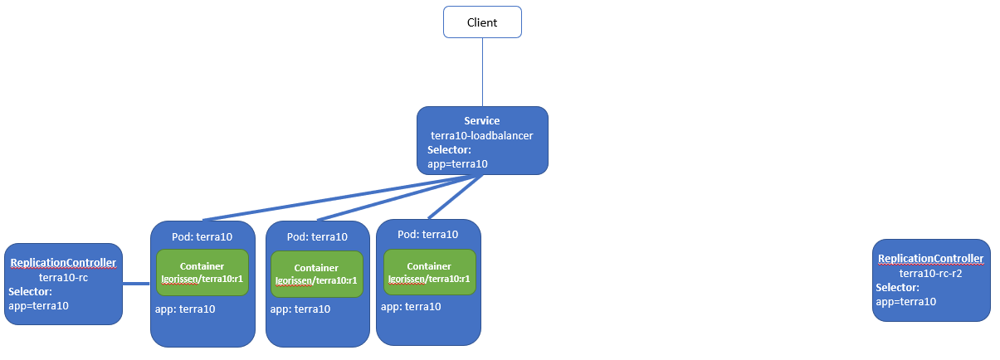
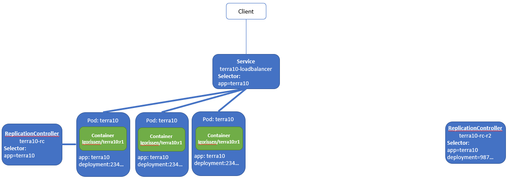
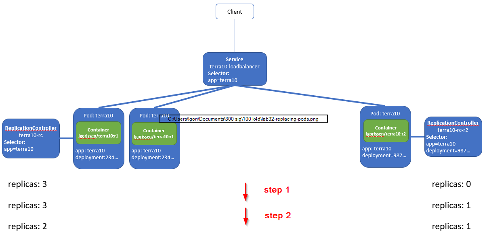
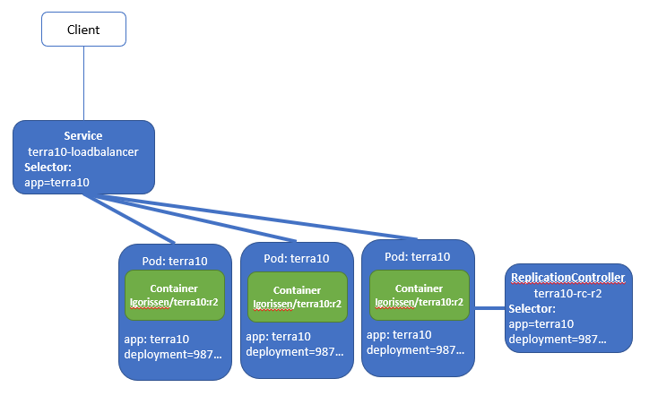

# 32. Deployments: automatic - ReplicationController

This lab shows how a ReplicationController can do an automatic upgrade.

The lab is using the same container images: `lgorissen/terra10:r1` and `lgorissen/terra10:r2`. Their definitions are also put in the `lab 32` directory, as well as all the other files. You don't have to build the Containers - they are already available on Docker Hub.

 
## 32.1 Start set-up

The lab's start set-up is the configuration below:


The manifest files should not be a big surprise. The ReplicationController is in file `terra10-replicationcontroller.yaml` :

```bash
apiVersion: v1
kind: ReplicationController
metadata:
  name: terra10-rc
spec:
  replicas: 3
  selector:
    matchExpressions:
      - key: app
        operator: In
        values:
         - terra10
  template:
    metadata:
      labels:
        app: terra10
    spec:
      containers:
      - name: terra10
        image: lgorissen/terra10:r1
```

The LoadBalancer Service is in file `terra10-service-loadbalancer.yaml`:

```bash
apiVersion: v1
kind: Service
metadata:
  name: terra10-loadbalancer
spec:
  type: LoadBalancer
  ports:
  - port: 80
    targetPort: 8080
  selector:
    app: terra10
```

Create the set-up:

```bash
developer@developer-VirtualBox:~/projects/k4d/lab 32$ kubectl create -f terra10-replicationcontroller.yaml 
replicationcontroller/terra10-rc created
developer@developer-VirtualBox:~/projects/k4d/lab 32$ kubectl get rc
NAME         DESIRED   CURRENT   READY     AGE
terra10-rc   3         3         3         7s
developer@developer-VirtualBox:~/projects/k4d/lab 32$ kubectl get pod
NAME               READY     STATUS    RESTARTS   AGE
terra10-rc-5hv5q   1/1       Running   0          10s
terra10-rc-7sxhr   1/1       Running   0          10s
terra10-rc-xmtlm   1/1       Running   0          10s
developer@developer-VirtualBox:~/projects/k4d/lab 32$ kubectl create -f terra10-service-loadbalancer.yaml 
service/terra10-loadbalancer created
developer@developer-VirtualBox:~/projects/k4d/lab 32$ kubectl get service
NAME                   TYPE           CLUSTER-IP       EXTERNAL-IP   PORT(S)        AGE
kubernetes             ClusterIP      10.96.0.1        <none>        443/TCP        39d
terra10-loadbalancer   LoadBalancer   10.103.201.231   <pending>     80:30906/TCP   7s
developer@developer-VirtualBox:~/projects/k4d/lab 32$ 
```

And use a *curl* loop to test:

```bash
developer@developer-VirtualBox:~/projects/k4d/lab 32$ kubectl describe service terra10-loadbalancer | grep "^IP"
IP:                       10.103.201.231
developer@developer-VirtualBox:~/projects/k4d/lab 32$ while true; do curl 10.103.201.231:80;sleep 2; done
Hello, you landed on Terra10 (version r1) and host terra10-rc-xmtlm welcomes you!
Hello, you landed on Terra10 (version r1) and host terra10-rc-xmtlm welcomes you!
Hello, you landed on Terra10 (version r1) and host terra10-rc-5hv5q welcomes you!
Hello, you landed on Terra10 (version r1) and host terra10-rc-xmtlm welcomes you!
Hello, you landed on Terra10 (version r1) and host terra10-rc-7sxhr welcomes you!
Hello, you landed on Terra10 (version r1) and host terra10-rc-7sxhr welcomes you!
^C
developer@developer-VirtualBox:~/projects/k4d/lab 32$ 
```

## 32.2 Do the upgrade - theory


Our upgrade goal is to upgrade to the new version of the Container image. i.e. `lgorissen/terra10:r2`. In the process, ReplicationController `terra10-rc` will be upgraded to ReplicationController `terra10-rc-r2`. Only 1 *kubectl* command is enough to do that:

```bash
developer@developer-VirtualBox:~/projects/k4d/lab 32$ kubectl rolling-update terra10-rc terra10-rc-r2 --image=lgorissen/terra10:r2
```

You can recognize the ReplicationController names and the name of the new image. What this command will do is:


**1 - Add a new ReplicationController**

A new ReplicationController named `terra10-rc-r2` is added, with `replicas: 0`




**2 - Add the label 'deployment'**

The label *deployment* is added to the Pods and ReplicationController's Selector. The original Pods and ReplicationController will have a different value for the *deployment* label than the value that the new ReplicationController (and future Pods) have/get:
 



**3 - And start replacing Pods**

The Pods are now replaced one-by-one, by changing the `replicas` count in each of the ReplicationControllers



**4 - Until all Pods are replaced**

When all Pods are replaced, the final situation is:



That's the theory ...


## 32.3 Do the upgrade - for real ;-)

So, ready to do the upgrade for real?

First, open a separate window and start your *curl* test loop. During the upgrade, you may want to examine it every now and then, to verify what is happening to your service:

```bash
developer@developer-VirtualBox:~/projects/k4d/lab 32$ while true; do curl 10.103.201.231:80;sleep 2; done
Hello, you landed on Terra10 (version r1) and host terra10-rc-5hv5q welcomes you!
Hello, you landed on Terra10 (version r1) and host terra10-rc-7sxhr welcomes you!
Hello, you landed on Terra10 (version r1) and host terra10-rc-7sxhr welcomes you!
Hello, you landed on Terra10 (version r1) and host terra10-rc-5hv5q welcomes you!
Hello, you landed on Terra10 (version r1) and host terra10-rc-5hv5q welcomes you!
Hello, you landed on Terra10 (version r1) and host terra10-rc-xmtlm welcomes you!

```

Go to your other window and give the rolling update command:

```bash
developer@developer-VirtualBox:~/projects/k4d/lab 32$ kubectl rolling-update terra10-rc terra10-rc-r2 --image=lgorissen/terra10:r2
Command "rolling-update" is deprecated, use "rollout" instead
Created terra10-rc-r2
Scaling up terra10-rc-r2 from 0 to 3, scaling down terra10-rc from 3 to 0 (keep 3 pods available, don't exceed 4 pods)
Scaling terra10-rc-r2 up to 1
Scaling terra10-rc down to 2
Scaling terra10-rc-r2 up to 2
Scaling terra10-rc down to 1
Scaling terra10-rc-r2 up to 3
Scaling terra10-rc down to 0
Update succeeded. Deleting terra10-rc
replicationcontroller/terra10-rc-r2 rolling updated to "terra10-rc-r2"
developer@developer-VirtualBox:~/projects/k4d/lab 32$
```

Notes:

- check the *curl* window: you should see the changes when the Pods are added and deleted
- the update log shows that `Command "rolling-update" is deprecated, use "rollout" instead`. This refers to another, even better way to update. That involves using the Kubernetes *Deployment* resource, which is described in a separate (next) lab
- the update keeps the number of Pods between 3 and 4
- the rolling-update can be further tailored: please refer to the Kubernetes reference documentation: https://kubernetes.io/docs/reference/generated/kubectl/kubectl-commands#rolling-update

 
## 32.4 Check the final situation

Spend some time examining the final upgraded situation.

The first ReplicationController `terra10-rc` is gone:

```bash
developer@developer-VirtualBox:~/projects/k4d/lab 32$ kubectl get rc
NAME            DESIRED   CURRENT   READY     AGE
terra10-rc-r2   3         3         3         12m
developer@developer-VirtualBox:~/projects/k4d/lab 32$
```

Have a look at the new ReplicationController. Note that (1) the 'deployment' label is still present and (2) the new Container image `lgorissen/terra10:r2` is used:

```bash
developer@developer-VirtualBox:~/projects/k4d/lab 32$ kubectl describe rc terra10-rc-r2 
Name:         terra10-rc-r2
Namespace:    default
Selector:     app=terra10,deployment=ed66b96b94760b8237d87d0b74b7ee73
Labels:       app=terra10
Annotations:  <none>
Replicas:     3 current / 3 desired
Pods Status:  3 Running / 0 Waiting / 0 Succeeded / 0 Failed
Pod Template:
  Labels:  app=terra10
           deployment=ed66b96b94760b8237d87d0b74b7ee73
  Containers:
   terra10:
    Image:        lgorissen/terra10:r2
    Port:         <none>
    Host Port:    <none>
    Environment:  <none>
    Mounts:       <none>
  Volumes:        <none>
Events:
  Type    Reason            Age   From                    Message
  ----    ------            ----  ----                    -------
  Normal  SuccessfulCreate  14m   replication-controller  Created pod: terra10-rc-r2-zrx4m
  Normal  SuccessfulCreate  13m   replication-controller  Created pod: terra10-rc-r2-v6jxw
  Normal  SuccessfulCreate  12m   replication-controller  Created pod: terra10-rc-r2-t5bth
developer@developer-VirtualBox:~/projects/k4d/lab 32$ 
```

The `deployment` label remains present in the Pods after the upgrade:

```bash
developer@developer-VirtualBox:~/projects/k4d/lab 32$ kubectl get pod --show-labels 
NAME                  READY     STATUS    RESTARTS   AGE       LABELS
terra10-rc-r2-t5bth   1/1       Running   0          10m       app=terra10,deployment=ed66b96b94760b8237d87d0b74b7ee73
terra10-rc-r2-v6jxw   1/1       Running   0          11m       app=terra10,deployment=ed66b96b94760b8237d87d0b74b7ee73
terra10-rc-r2-zrx4m   1/1       Running   0          12m       app=terra10,deployment=ed66b96b94760b8237d87d0b74b7ee73
developer@developer-VirtualBox:~/projects/k4d/lab 32$
```

... and the service has not changed, except for the Endpoints of the new Pods that the Selector will find:

```bash
developer@developer-VirtualBox:~/projects/k4d/lab 32$ kubectl describe service terra10-loadbalancer 
Name:                     terra10-loadbalancer
Namespace:                default
Labels:                   <none>
Annotations:              <none>
Selector:                 app=terra10
Type:                     LoadBalancer
IP:                       10.103.201.231
Port:                     <unset>  80/TCP
TargetPort:               8080/TCP
NodePort:                 <unset>  30906/TCP
Endpoints:                172.17.0.5:8080,172.17.0.8:8080,172.17.0.9:8080
Session Affinity:         None
External Traffic Policy:  Cluster
Events:                   <none>
developer@developer-VirtualBox:~/projects/k4d/lab 32$
```


## 32.5 Summary

In the previous lab, we agreed that a manual upgrade was complex and error prone. Well ... there may be people that claim otherwise, but just don't believe them.

This lab has shown an automatic upgrade of an ReplicationController, which is ... still not quite what we want. Basically, the upgrade is now automated, but still has some shortcomings:

- the upgrade messes with your ReplicationController definition. It adds labels and even replaces it with a complete different one. Now that is confusing: you want your resources under version control and not being changed by the platform itself. 
- in case of an error during the upgrade, the system will be left behind in an inconsistent status for the involved Pods and ReplicationController(s). And note that the upgrade is driven from `kubectl`, sending out commands to the Kubernetes objects. A network failure would be enough to stop the upgrade.

The next lab shows how upgrades are done using a ... *Deployment*.

 But first ...

... clean up!


