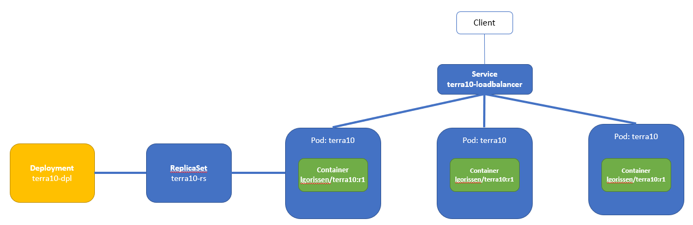
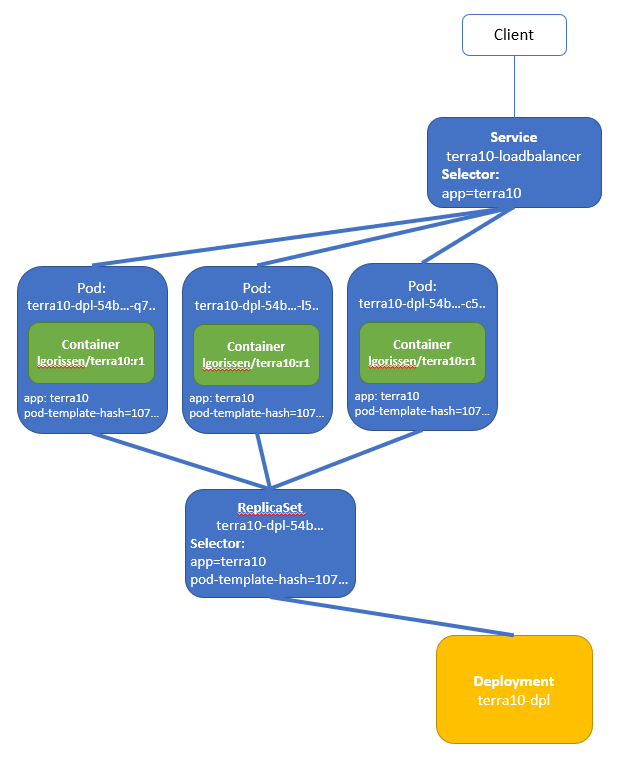
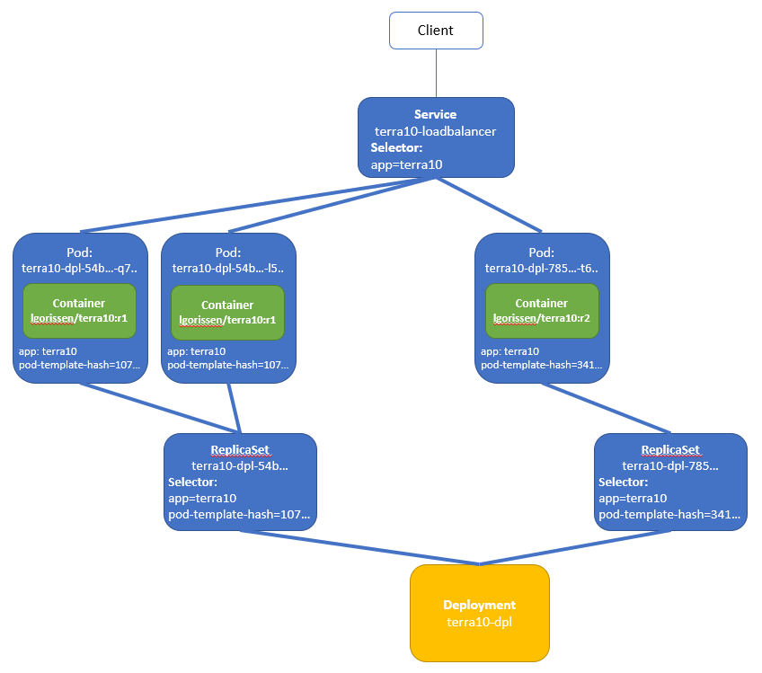
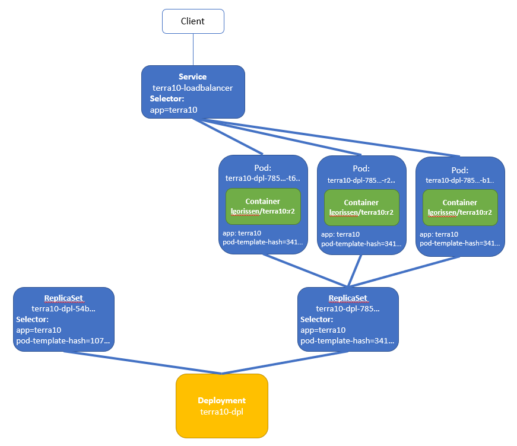

# 33. Deployments: using the Kubernetes Deployment

The previous labs have shown 2 options how to upgrade - manually and using the ReplicationController upgrade feature. Both options have their drawbacks, mainly in the area of complexity and robustness. In this lab we will work with the Kubernetes Deployment, which

- is a much simpler way to do an upgrade, and
- moves the upgrade orchestration to the Kubernetes control plane

The Deployment uses a ReplicaSet which in turn controls the Pods:



To be more precise: the Deployment creates the ReplicaSet that in turn controls the Pods.
 
## The Deployment

This lab will demonstrate a Deployment upgrade with the same Container images as the previous upgrade labs, i.e. `lgorissen/terra10:r1` and `lgorissen/terra10:r2`. The files can - of course - be found in the `lab 33` directory, as well as all the other stuff. Don't build the Containers - they are in Docker Hub.

The Deployment manifest is in file `terra10-deployment.yaml` :

```bash
apiVersion: v1
kind: Deployment                         # Deployment
metadata:                                # ...rest is pretty similar to a ReplicationController
  name: terra10-dpl
spec:
  replicas: 3
  selector:
    app: terra10
  template:
    metadata:
      name: terra10
      labels:
        app: terra10
    spec:
      containers:
      - name: terra10
        image: lgorissen/terra10:r1      
```

Create the Deployment and check what is created:

```bash
developer@developer-VirtualBox:~/projects/k4d/lab 33$ k create -f terra10-deployment.yaml 
deployment.apps/terra10-dpl created
developer@developer-VirtualBox:~/projects/k4d/lab 33$ k get deployment
NAME          DESIRED   CURRENT   UP-TO-DATE   AVAILABLE   AGE
terra10-dpl   3         3         3            3           7s
developer@developer-VirtualBox:~/projects/k4d/lab 33$ k get rs
NAME                     DESIRED   CURRENT   READY     AGE
terra10-dpl-54bb4dbdcc   3         3         3         10s
developer@developer-VirtualBox:~/projects/k4d/lab 33$ k get pod
NAME                           READY     STATUS    RESTARTS   AGE
terra10-dpl-54bb4dbdcc-7hqfb   1/1       Running   0          13s
terra10-dpl-54bb4dbdcc-dl6lv   1/1       Running   0          13s
terra10-dpl-54bb4dbdcc-q2r4b   1/1       Running   0          13s
developer@developer-VirtualBox:~/projects/k4d/lab 33$ 
```

Note how the naming of ReplicationSet and Pods is derived from the Deployment name.

Create the Loadbalancer Service:

```bash
developer@developer-VirtualBox:~/projects/k4d/lab 33$ cat terra10-service-loadbalancer.yaml 
apiVersion: v1
kind: Service
metadata:
  name: terra10-loadbalancer
spec:
  type: LoadBalancer
  ports:
  - port: 80
    targetPort: 8080
  selector:
    app: terra10
developer@developer-VirtualBox:~/projects/k4d/lab 33$ k create -f terra10-service-loadbalancer.yaml 
service/terra10-loadbalancer created
developer@developer-VirtualBox:~/projects/k4d/lab 33$ k get service terra10-loadbalancer 
NAME                   TYPE           CLUSTER-IP      EXTERNAL-IP   PORT(S)        AGE
terra10-loadbalancer   LoadBalancer   10.100.80.247   <pending>     80:30119/TCP   19s
developer@developer-VirtualBox:~/projects/k4d/lab 33$ 
```

and test it:

```bash
developer@developer-VirtualBox:~$ k get service terra10-loadbalancer 
NAME                   TYPE           CLUSTER-IP      EXTERNAL-IP   PORT(S)        AGE
terra10-loadbalancer   LoadBalancer   10.100.80.247   <pending>     80:30119/TCP   1m
developer@developer-VirtualBox:~$ while true; do curl 10.100.80.247:80; sleep 2; done
Hello, you landed on Terra10 (version r1) and host terra10-dpl-54bb4dbdcc-dl6lv welcomes you!
Hello, you landed on Terra10 (version r1) and host terra10-dpl-54bb4dbdcc-dl6lv welcomes you!
Hello, you landed on Terra10 (version r1) and host terra10-dpl-54bb4dbdcc-7hqfb welcomes you!
Hello, you landed on Terra10 (version r1) and host terra10-dpl-54bb4dbdcc-q2r4b welcomes you!
Hello, you landed on Terra10 (version r1) and host terra10-dpl-54bb4dbdcc-q2r4b welcomes you!
Hello, you landed on Terra10 (version r1) and host terra10-dpl-54bb4dbdcc-7hqfb welcomes you!
^C
developer@developer-VirtualBox:~$
```

So far, all is OK. Ready for upgrade.

## Upgrade - the theory

The start situation for the upgrade is:



After giving the upgrade command,the Deployment adds a new ReplicationSet and gradually adds/removes Pods:



Until the final situation is reached:



Note that the ReplicaSet remains present i.e. it is not deleted. That will make a rollback easier.
 

## Upgrade - for real ;-)

So, ready to do the upgrade for real?

Upgrading with a Deployment is easy: just change the Container image name in the Deployment manifest and ... Kubernetes will handle the rest.

**Apply brakes**

There's only one thing you need to do before upgrading, and that is to slow down the upgrade, so you can monitor in your test loop what is happening:

```bash
developer@developer-VirtualBox:~/projects/k4d/lab 33$ k patch deployment terra10-dpl -p '{"spec": {"minReadySeconds":20}}'
deployment.extensions/terra10-dpl patched
developer@developer-VirtualBox:~/projects/k4d/lab 33$ k describe terra10-dpl 
error: the server doesn't have a resource type "terra10-dpl"
developer@developer-VirtualBox:~/projects/k4d/lab 33$ k describe deployment terra10-dpl 
Name:                   terra10-dpl
Namespace:              default
CreationTimestamp:      Fri, 16 Nov 2018 15:32:21 +0100
Labels:                 app=terra10
Annotations:            deployment.kubernetes.io/revision=1
Selector:               app=terra10
Replicas:               3 desired | 3 updated | 3 total | 3 available | 0 unavailable
StrategyType:           RollingUpdate
MinReadySeconds:        20
RollingUpdateStrategy:  25% max unavailable, 25% max surge
Pod Template:
  Labels:  app=terra10
  Containers:
   terra10:
    Image:        lgorissen/terra10:r1
    Port:         <none>
    Host Port:    <none>
    Environment:  <none>
    Mounts:       <none>
  Volumes:        <none>
Conditions:
  Type           Status  Reason
  ----           ------  ------
  Available      True    MinimumReplicasAvailable
  Progressing    True    NewReplicaSetAvailable
OldReplicaSets:  <none>
NewReplicaSet:   terra10-dpl-54bb4dbdcc (3/3 replicas created)
Events:
  Type    Reason             Age   From                   Message
  ----    ------             ----  ----                   -------
  Normal  ScalingReplicaSet  4m    deployment-controller  Scaled up replica set terra10-dpl-54bb4dbdcc to 3
developer@developer-VirtualBox:~/projects/k4d/lab 33$  
```

The *minReadySecond* value determines how long a new Pod must be *ready* before the upgrade process continues with the next step.

**do upgrade**

Now, patch the image and watch what happens:

```bash
developer@developer-VirtualBox:~/projects/k4d/lab 33$ k set image deployment terra10-dpl terra10=lgorissen/terra10:r2
deployment.extensions/terra10-dpl image updated
developer@developer-VirtualBox:~/projects/k4d/lab 33$ 
```

Now, observe in the test window that gradually, more and more responses come from the new Container image:

```bash
Hello, you landed on Terra10 (version r2) and host terra10-dpl-78599579b-jnzzf welcomes you!
Hello, you landed on Terra10 (version r1) and host terra10-dpl-54bb4dbdcc-7hqfb welcomes you!
Hello, you landed on Terra10 (version r1) and host terra10-dpl-54bb4dbdcc-7hqfb welcomes you!
Hello, you landed on Terra10 (version r2) and host terra10-dpl-78599579b-jnzzf welcomes you!
Hello, you landed on Terra10 (version r1) and host terra10-dpl-54bb4dbdcc-7hqfb welcomes you!
Hello, you landed on Terra10 (version r2) and host terra10-dpl-78599579b-4dx47 welcomes you!
Hello, you landed on Terra10 (version r2) and host terra10-dpl-78599579b-4dx47 welcomes you!
Hello, you landed on Terra10 (version r2) and host terra10-dpl-78599579b-jnzzf welcomes you!
Hello, you landed on Terra10 (version r2) and host terra10-dpl-78599579b-jnzzf welcomes you!
```

... until finally all responses come from the new Container image.

The upgrade:

1. created a new ReplicaSet
2. gradually deleted Pods in the old Replicaset and create new Pods in the new ReplicaSet

The new situation is:


**verify new situation**

Verify the new situation. First, look at the *Deployment*:

- a new ReplicaSet has been added
- the upgrade events are shown at the end of the description

```bash
developer@developer-VirtualBox:~/projects/k4d/lab 33$ k get deployment
NAME          DESIRED   CURRENT   UP-TO-DATE   AVAILABLE   AGE
terra10-dpl   3         3         3            3           9m
developer@developer-VirtualBox:~/projects/k4d/lab 33$ k describe deployment terra10-dpl 
Name:                   terra10-dpl
Namespace:              default
CreationTimestamp:      Fri, 16 Nov 2018 15:32:21 +0100
Labels:                 app=terra10
Annotations:            deployment.kubernetes.io/revision=2
Selector:               app=terra10
Replicas:               3 desired | 3 updated | 3 total | 3 available | 0 unavailable
StrategyType:           RollingUpdate
MinReadySeconds:        20
RollingUpdateStrategy:  25% max unavailable, 25% max surge
Pod Template:
  Labels:  app=terra10
  Containers:
   terra10:
    Image:        lgorissen/terra10:r2
    Port:         <none>
    Host Port:    <none>
    Environment:  <none>
    Mounts:       <none>
  Volumes:        <none>
Conditions:
  Type           Status  Reason
  ----           ------  ------
  Available      True    MinimumReplicasAvailable
  Progressing    True    NewReplicaSetAvailable
OldReplicaSets:  <none>
NewReplicaSet:   terra10-dpl-78599579b (3/3 replicas created)
Events:
  Type    Reason             Age   From                   Message
  ----    ------             ----  ----                   -------
  Normal  ScalingReplicaSet  9m    deployment-controller  Scaled up replica set terra10-dpl-54bb4dbdcc to 3
  Normal  ScalingReplicaSet  2m    deployment-controller  Scaled up replica set terra10-dpl-78599579b to 1
  Normal  ScalingReplicaSet  1m    deployment-controller  Scaled down replica set terra10-dpl-54bb4dbdcc to 2
  Normal  ScalingReplicaSet  1m    deployment-controller  Scaled up replica set terra10-dpl-78599579b to 2
  Normal  ScalingReplicaSet  1m    deployment-controller  Scaled down replica set terra10-dpl-54bb4dbdcc to 1
  Normal  ScalingReplicaSet  1m    deployment-controller  Scaled up replica set terra10-dpl-78599579b to 3
  Normal  ScalingReplicaSet  1m    deployment-controller  Scaled down replica set terra10-dpl-54bb4dbdcc to 0
developer@developer-VirtualBox:~/projects/k4d/lab 33$ 
```

Verify the *ReplicaSet*:

- a second ReplicaSet has been added
- 3 Pods are running for the new ReplicaSet, and 0 Pods for the original ReplicaSet

```bash
developer@developer-VirtualBox:~/projects/k4d/lab 33$ k get rs
NAME                     DESIRED   CURRENT   READY     AGE
terra10-dpl-54bb4dbdcc   0         0         0         12m
terra10-dpl-78599579b    3         3         3         5m
developer@developer-VirtualBox:~/projects/k4d/lab 33$ k describe rs terra10-dpl-78599579b 
Name:           terra10-dpl-78599579b
Namespace:      default
Selector:       app=terra10,pod-template-hash=341551356
Labels:         app=terra10
                pod-template-hash=341551356
Annotations:    deployment.kubernetes.io/desired-replicas=3
                deployment.kubernetes.io/max-replicas=4
                deployment.kubernetes.io/revision=2
Controlled By:  Deployment/terra10-dpl
Replicas:       3 current / 3 desired
Pods Status:    3 Running / 0 Waiting / 0 Succeeded / 0 Failed
Pod Template:
  Labels:  app=terra10
           pod-template-hash=341551356
  Containers:
   terra10:
    Image:        lgorissen/terra10:r2
    Port:         <none>
    Host Port:    <none>
    Environment:  <none>
    Mounts:       <none>
  Volumes:        <none>
Events:
  Type    Reason            Age   From                   Message
  ----    ------            ----  ----                   -------
  Normal  SuccessfulCreate  5m    replicaset-controller  Created pod: terra10-dpl-78599579b-4dx47
  Normal  SuccessfulCreate  5m    replicaset-controller  Created pod: terra10-dpl-78599579b-jnzzf
  Normal  SuccessfulCreate  4m    replicaset-controller  Created pod: terra10-dpl-78599579b-5rgph
developer@developer-VirtualBox:~/projects/k4d/lab 33$ 
```

Verify the new Pods:

- note the Lab *pod-template-hash* label that links the Pods to the ReplicaSet's Selector

```bash
developer@developer-VirtualBox:~/projects/k4d/lab 33$ k get pod --show-labels 
NAME                          READY     STATUS    RESTARTS   AGE       LABELS
terra10-dpl-78599579b-4dx47   1/1       Running   0          7m        app=terra10,pod-template-hash=341551356
terra10-dpl-78599579b-5rgph   1/1       Running   0          6m        app=terra10,pod-template-hash=341551356
terra10-dpl-78599579b-jnzzf   1/1       Running   0          6m        app=terra10,pod-template-hash=341551356
developer@developer-VirtualBox:~/projects/k4d/lab 33$
```

... and look at the Deployment's rollout history:

```bash
developer@developer-VirtualBox:~/projects/k4d/lab 33$ k rollout history deployment terra10-dpl 
deployments "terra10-dpl"
REVISION  CHANGE-CAUSE
1         <none>
2         <none>

developer@developer-VirtualBox:~/projects/k4d/lab 33$ 
```


Well, this upgrade was simple!

## Rollback

And now you will undo the rollout. Give the `rollout undo` command:

```bash
developer@developer-VirtualBox:~/projects/k4d/lab 33$ k rollout history deployment terra10-dpl 
deployments "terra10-dpl"
REVISION  CHANGE-CAUSE
1         <none>
2         <none>

developer@developer-VirtualBox:~/projects/k4d/lab 33$ k rollout undo deployment terra10-dpl --to-revision=1
deployment.extensions/terra10-dpl
developer@developer-VirtualBox:~/projects/k4d/lab 33$ 
```

Note that the Revision numbers correspond to the ReplicaSets that are created bu the Deployment!


By now, you should be able to:

- Watch your test window!
- Verify the new status!


## Additionally...

**Upgrade strategies**

The Deployment knows 2 upgrade strategies:

1. RollingUpdate: Pods are updated in a rolling fashion. The update process can be tuned using the *maxUnavailable*  and *maxSurge* : https://kubernetes.io/docs/concepts/workloads/controllers/deployment/#writing-a-deployment-spec 
2. Recreate: all existing Pods are killed before new ones are created


**how to change the Deployment**

There are several *kubectl* commands that can be used to change the Deployment manifest:

|  Command          | Description                                |
|-------------------|--------------------------------------------|
| kubectl edit      | Change the manifest in your editor.        |
| kubectl patch     | Modify individual properties of the Deployment.
| kubectl apply     | Modify the Deployment be applying a complete definition (YAML or JSON)  object file.  |
| kubectl replace   | Replaces the Deployment with a new one, specified in a complete definition file (YAML or JSON)|
| kubectl set image | Changes the Container image defined in the Deployment. |


## Summary

This lab has shown how to upgrade using the Kubernetes Deployment. This is a lot easier, server based, and therefore less error prone.

There are more options with Deployments, so it is well worthwhile to read the reference documentation: https://kubernetes.io/docs/concepts/workloads/controllers/deployment/ 


But first ...

... clean up!


