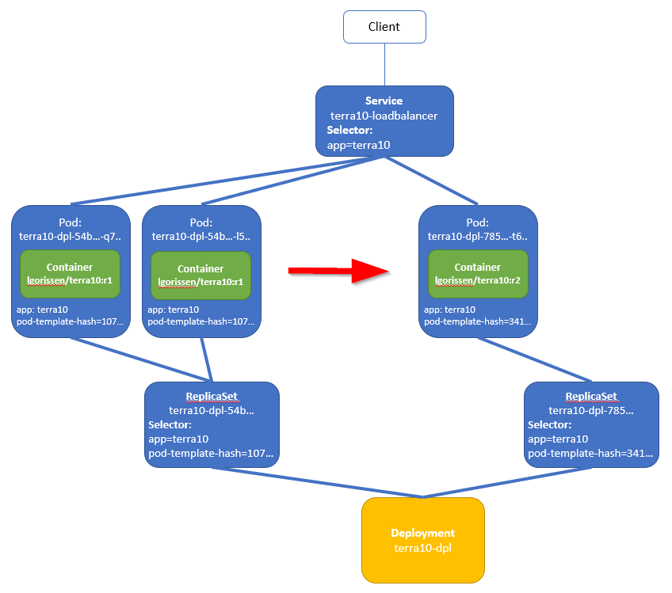
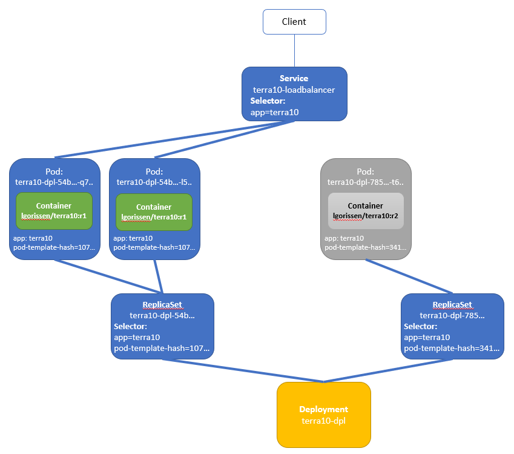
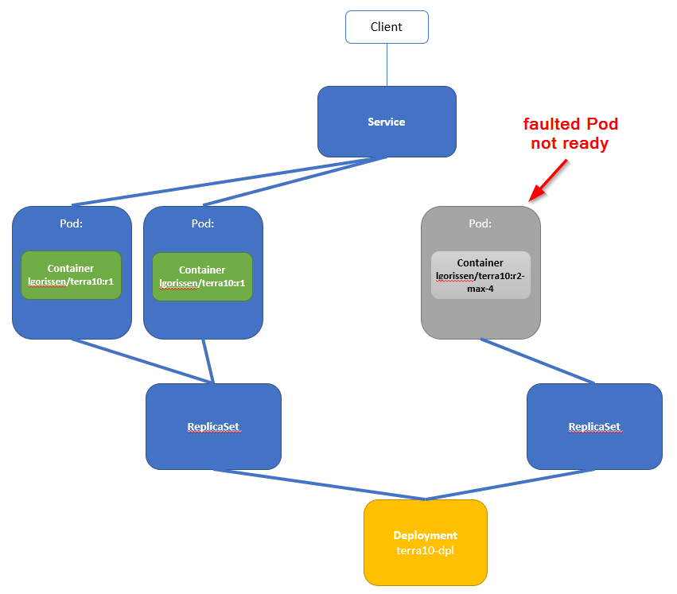

# 34. Deployments: readiness probes block bad rollouts

Lab 33 has shown how the Deployment supports an easy upgrade. Also, it was shown how to do a rollback.

This Lab will show how the readiness probe can be used to automatically block the rollout of ' bad' Pods.


## Theory


During a rollout, the Deployment gradually replaces the old Pods by new Pods, using the ReplicaSet. This is illustrated in the figure below, where there are 2 'old' Pods on the left side, and 1 new Pods in the right side:



When the Deployment rollout process creates a new Pod:

- The Deployment increases the Replicas property in the ReplicaSet,
- The ReplicaSet creates a new Pod
- Waits for the new Pods to be ready, and ...
- Wait another *minReadySeconds* to verify that the new Pod stays ready
- ... before continuing with the rollout process

This *minReadySeconds* is a Deployment property and can be set as part of the Deployment manifest. Kubernetes determines if a Pod is *ready* using readiness probe. If no readiness probe is available, the Pod is *ready* by default.

When, during the rollout, a Pod is marked as *not Ready* because its readiness probe reports failure, then the Pod is removed from the Service.



When the new Pod does not become available, the rollout process is stopped. You can then roll back the deployment.


## Upgrade - prepare the set-up

All of that sounds great in theory, let's see if there is a match with reality.

We will start with creating a Deployment that will result in the situation below:


The Deployment manifest file is named `terra10-deployment.yaml` and can - like all other files - be found in the `lab 34`  directory:

```bash
apiVersion: apps/v1beta1
kind: Deployment                     # Object type is Deployment
metadata:
  name: terra10-dpl                  # Deployment name
spec:
  replicas: 3                        # 3 Pods simultaneously
  minReadySeconds: 20                # during upgrade, wait for Pod to be ready for 20 secs, then continue rollout
  strategy:                          # upgrade strategy
    rollingUpdate:                   # defines that during rollout:
      maxSurge: 1                    # .. max # Pods that can be created over desired number
      maxUnavailable: 0              # max # unavailable Pods
    type: RollingUpdate              # RollingUpdate is upgrade strategy
  template:
    metadata:
      name: terra10
      labels:
        app: terra10
    spec:
      containers:
      - name: terra10
        image: lgorissen/terra10:r1
        readinessProbe:              # readyness probe
          periodSeconds: 1           # polls every second
          httpGet:                   # ... with an http get
            path: /                  # ... on path /
            port: 8080               # ... on port 8080
```

For a more detailed explanation of the RollingUpdate strategy parameters, please refer to: https://kubernetes.io/docs/concepts/workloads/controllers/deployment/#writing-a-deployment-spec

**Start this deployment:**

```bash
developer@developer-VirtualBox:~/projects/k4d/lab 34$ k create -f terra10-deployment.yaml 
deployment.apps/terra10-dpl created
developer@developer-VirtualBox:~/projects/k4d/lab 34$ k get deployment terra10-dpl 
NAME          DESIRED   CURRENT   UP-TO-DATE   AVAILABLE   AGE
terra10-dpl   3         3         3            0           7s
developer@developer-VirtualBox:~/projects/k4d/lab 34$ k get replicaset terra10-dpl-85fdc7bcb9 
NAME                     DESIRED   CURRENT   READY     AGE
terra10-dpl-85fdc7bcb9   3         3         3         17s
developer@developer-VirtualBox:~/projects/k4d/lab 34$ k get pod --show-labels 
NAME                           READY     STATUS    RESTARTS   AGE       LABELS
terra10-dpl-85fdc7bcb9-k5n8f   1/1       Running   0          34s       app=terra10,pod-template-hash=4198736765
terra10-dpl-85fdc7bcb9-vtvn9   1/1       Running   0          34s       app=terra10,pod-template-hash=4198736765
terra10-dpl-85fdc7bcb9-z9pt7   1/1       Running   0          34s       app=terra10,pod-template-hash=4198736765
developer@developer-VirtualBox:~/projects/k4d/lab 34$ 
```


**Create the Loadbalancer Service:**

We have to create a Loadbalancer Service to access the Pods:

```bash
   app: terra10
developer@developer-VirtualBox:~/projects/k4d/lab 34$ cat terra10-service-loadbalancer.yaml 
apiVersion: v1
kind: Service
metadata:
  name: terra10-loadbalancer
spec:
  type: LoadBalancer
  ports:
  - port: 80
    targetPort: 8080
  selector:
    app: terra10
developer@developer-VirtualBox:~/projects/k4d/lab 34$ k create -f terra10-service-loadbalancer.yaml 
service/terra10-loadbalancer created
developer@developer-VirtualBox:~/projects/k4d/lab 34$ k get service terra10-loadbalancer 
NAME                   TYPE           CLUSTER-IP     EXTERNAL-IP   PORT(S)        AGE
terra10-loadbalancer   LoadBalancer   10.97.240.56   <pending>     80:32421/TCP   17s
developer@developer-VirtualBox:~/projects/k4d/lab 34$ 
```

**Start the test loop:**

Start the test loop in a separate window and keep it running:

```bash
developer@developer-VirtualBox:~$ while true; do curl 10.97.240.56:80; sleep 1; done
Hello, you landed on Terra10 (version r1) and host terra10-dpl-85fdc7bcb9-k5n8f welcomes you!
Hello, you landed on Terra10 (version r1) and host terra10-dpl-85fdc7bcb9-k5n8f welcomes you!
Hello, you landed on Terra10 (version r1) and host terra10-dpl-85fdc7bcb9-vtvn9 welcomes you!
Hello, you landed on Terra10 (version r1) and host terra10-dpl-85fdc7bcb9-k5n8f welcomes you!
Hello, you landed on Terra10 (version r1) and host terra10-dpl-85fdc7bcb9-z9pt7 welcomes you!
Hello, you landed on Terra10 (version r1) and host terra10-dpl-85fdc7bcb9-vtvn9 welcomes you!
Hello, you landed on Terra10 (version r1) and host terra10-dpl-85fdc7bcb9-k5n8f welcomes you!
Hello, you landed on Terra10 (version r1) and host terra10-dpl-85fdc7bcb9-vtvn9 welcomes you!
Hello, you landed on Terra10 (version r1) and host terra10-dpl-85fdc7bcb9-z9pt7 welcomes you!
```

So far, all is OK. Ready for upgrade.

## Upgrade with a faulted Container

We have create a Container named `lgorissen/terra10:r2-max-4` that returns 4 times a `200 OK` response and after that, only `500 Internal Server Error` responses. The code can be found in the `terra10-max-4` folder. You don't have to build the Container yourself: it is already available in Docker Hub.

When we change the Container image in the Deployment to `lgorissen/terra10:r2-max-4`, the following will happen:

- a new ReplicaSet will be created 
- the new ReplicatSet will create a new Pod - with the faulty Container image
- the new Pod will initially report *ready* and be part of the Service
- after 4 requests, the Pod will be labeled as *not ready*, as the readiness probe reports
- the upgrade process will be stopped

In a diagram:



Let's get going:

```bash
developer@developer-VirtualBox:~/projects/k4d/lab 34$ k set image deployment terra10-dpl terra10=lgorissen/terra10:r2-max-4
deployment.extensions/terra10-dpl image updated
developer@developer-VirtualBox:~/projects/k4d/lab 34$
```
... and have a good look at what happens in your test window:

```
ello, you landed on Terra10 (version r1) and host terra10-dpl-85fdc7bcb9-vtvn9 welcomes you!
Hello, you landed on Terra10 (version r1) and host terra10-dpl-85fdc7bcb9-k5n8f welcomes you!
Hello, you landed on Terra10 (version r1) and host terra10-dpl-85fdc7bcb9-vtvn9 welcomes you!
Hello, you landed on Terra10 (version r2) and host terra10-dpl-7cfc7fc548-9qrft welcomes you!
Hello, you landed on Terra10 (version r1) and host terra10-dpl-85fdc7bcb9-z9pt7 welcomes you!
Hello, you landed on Terra10 (version r1) and host terra10-dpl-85fdc7bcb9-k5n8f welcomes you!
Something went wrong in your landing - this landing platform is malfunctioning: terra10-dpl-7cfc7fc548-9qrft
Hello, you landed on Terra10 (version r1) and host terra10-dpl-85fdc7bcb9-k5n8f welcomes you!
Hello, you landed on Terra10 (version r1) and host terra10-dpl-85fdc7bcb9-k5n8f welcomes you!
Hello, you landed on Terra10 (version r1) and host terra10-dpl-85fdc7bcb9-vtvn9 welcomes you!
Hello, you landed on Terra10 (version r1) and host terra10-dpl-85fdc7bcb9-z9pt7 welcomes you!
Hello, you landed on Terra10 (version r1) and host terra10-dpl-85fdc7bcb9-vtvn9 welcomes you!
Hello, you landed on Terra10 (version r1) and host terra10-dpl-85fdc7bcb9-z9pt7 welcomes you!
Hello, you landed on Terra10 (version r1) and host terra10-dpl-85fdc7bcb9-z9pt7 welcomes you!
Hello, you landed on Terra10 (version r1) and host terra10-dpl-85fdc7bcb9-vtvn9 welcomes you!
```

Above, we see:

- a single entry that hits the new Pod with Container `lgorissen/terra10:r2-max-4`
- an entry that shows that the new Pod is returning errors
- ... and then only responses coming from the old Pods

That matches with what was expected: see the list a bit higher.

Checking the configuration:

```bash
developer@developer-VirtualBox:~/projects/k4d/lab 34$ k get deployment terra10-dpl 
NAME          DESIRED   CURRENT   UP-TO-DATE   AVAILABLE   AGE
terra10-dpl   3         4         1            3           37m
developer@developer-VirtualBox:~/projects/k4d/lab 34$ k get replicaset
NAME                     DESIRED   CURRENT   READY     AGE
terra10-dpl-7cfc7fc548   1         1         0         4m
terra10-dpl-85fdc7bcb9   3         3         3         37m
developer@developer-VirtualBox:~/projects/k4d/lab 34$ k get pods --show-labels 
NAME                           READY     STATUS    RESTARTS   AGE       LABELS
terra10-dpl-7cfc7fc548-9qrft   0/1       Running   0          5m        app=terra10,pod-template-hash=3797397104
terra10-dpl-85fdc7bcb9-k5n8f   1/1       Running   0          37m       app=terra10,pod-template-hash=4198736765
terra10-dpl-85fdc7bcb9-vtvn9   1/1       Running   0          37m       app=terra10,pod-template-hash=4198736765
terra10-dpl-85fdc7bcb9-z9pt7   1/1       Running   0          37m       app=terra10,pod-template-hash=4198736765
developer@developer-VirtualBox:~/projects/k4d/lab 34$ 
```

Note how:

- the second ReplicaSet is created
- the new Pod is *not Ready*

Looking at the status of the upgrade process:

```bash
developer@developer-VirtualBox:~/projects/k4d/lab 34$ k rollout status deployment terra10-dpl 
Waiting for deployment "terra10-dpl" rollout to finish: 1 out of 3 new replicas have been updated...
^Cdeveloper@developer-VirtualBox:~/projects/k4d/lab 34$ 
```

The rollout process is indeed stopped ... all due to the faulty Container!


## Rollback

And now you will undo the rollout. Give the `rollout undo` command:

```bash
developer@developer-VirtualBox:~/projects/k4d/lab 34$ k rollout history deployment terra10-dpl 
deployments "terra10-dpl"
REVISION  CHANGE-CAUSE
1         <none>
2         <none>

developer@developer-VirtualBox:~/projects/k4d/lab 34$ k rollout undo deployment terra10-dpl --to-revision=1
deployment.extensions/terra10-dpl
developer@developer-VirtualBox:~/projects/k4d/lab 34$
```
Note that the Revision numbers correspond to the ReplicaSets that are created bu the Deployment!


Clean up!
