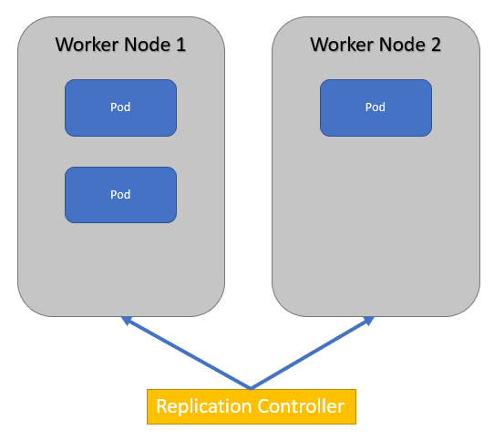
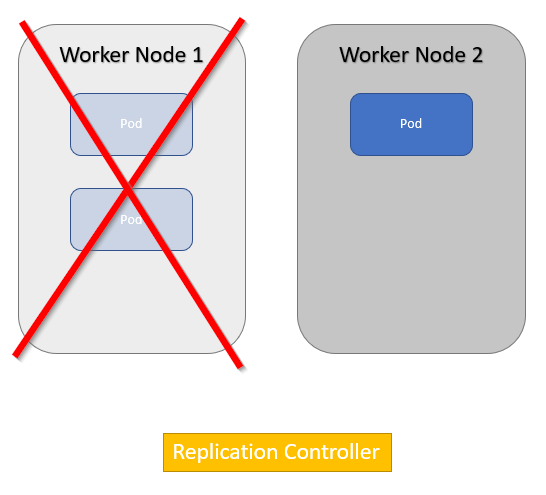
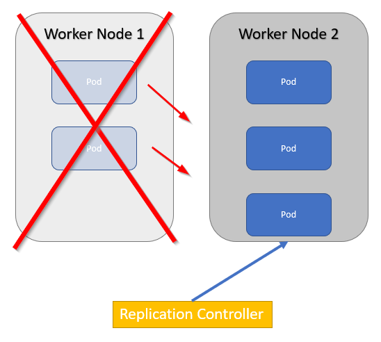

# 9. Replication Controllers

I like ReplicationControllers. To me, they feel like they are at the core of what Kubernetes is about: ensuring that your containers are all sound. 

In the Kubernetes reference manuals, the Replication Controller is described:
'A ReplicationController ensures that a specified number of pod replicas are running at any one time. In other words, a ReplicationController makes sure that a pod or a homogeneous set of pods is always up and available.'

Aha! So, if I have a Kubernetes cluster with 2 nodes, and a Replication Controller that specifies that 3 Pods have to be up and running, that could look like:

vNow, in the previous lab, we saw that using Liveness Probes, the kubelet can re-start a container in a Pod when it is malfunctioning or crashed. But ... when a complete Worker node crashes, the kubelet is also gone.

That is where the Replication Controller kicks in. The Replication Controller will then start the Pods on the other Worker node.

So, basically, the ReplicationController counts its Pods every now and then, and when the number of Pods does not match with the specified count, it will take action. 

